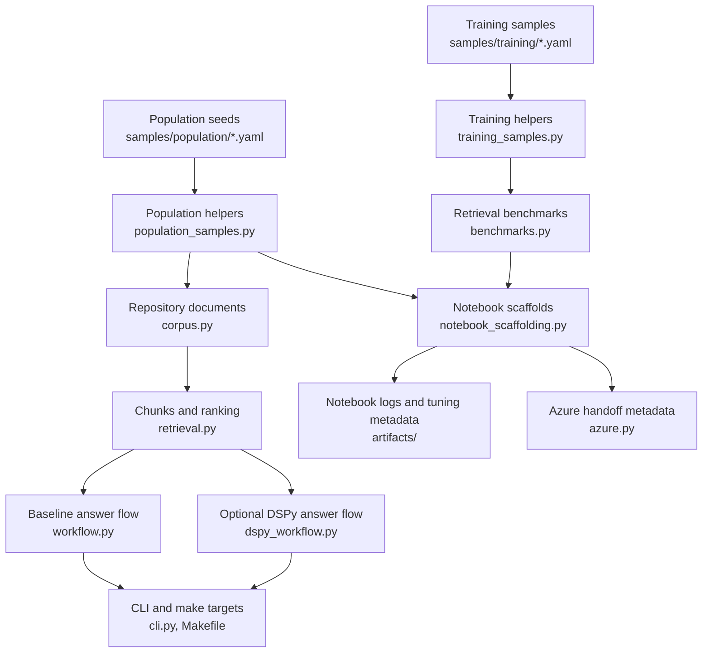

# DSPy Guide For This Repository

This file centralizes the repository's DSPy-related code, data, notebooks, tests, and workflow
surfaces. Use it as the main map for how repository content becomes retrieval context, how
training and evaluation samples are prepared, how the optional DSPy execution path works today,
and where true DSPy optimizer-driven development still needs to be added.

## Table Of Contents

- [Current Reality](#current-reality)
- [Fast Start](#fast-start)
- [End-To-End Map](#end-to-end-map)
- [Stage 1. Corpus Planning And Data Collection](#stage-1-corpus-planning-and-data-collection)
- [Stage 2. Repository Loading And Retrieval Baseline](#stage-2-repository-loading-and-retrieval-baseline)
- [Stage 3. Training Sample Preparation](#stage-3-training-sample-preparation)
- [Stage 4. Benchmark-Driven Development](#stage-4-benchmark-driven-development)
- [Stage 5. Optional DSPy Execution Path](#stage-5-optional-dspy-execution-path)
- [Stage 6. Notebook Automation And Artifacts](#stage-6-notebook-automation-and-artifacts)
- [Stage 7. Deployment Handoff, Not In-Repo Fine-Tuning](#stage-7-deployment-handoff-not-in-repo-fine-tuning)
- [Stage 8. Verification And Tests](#stage-8-verification-and-tests)
- [Current Gap And Direct Extension Path](#current-gap-and-direct-extension-path)
- [Cross-Reference Index](#cross-reference-index)

## Current Reality

The repository now has both an optional DSPy runtime path and a real compile-save-reload DSPy
program path.

Present now:

- [pyproject.toml](pyproject.toml) installs `dspy-ai` as part of the main Python package.
- [src/repo_rag_lab/dspy_training.py](src/repo_rag_lab/dspy_training.py) resolves LM
  configuration from CLI flags or environment variables, defines the repository-grounded
  `RepositoryRAGProgram`, runs `BootstrapFewShot` or `MIPROv2`, and persists artifacts under
  `artifacts/dspy/`.
- [src/repo_rag_lab/dspy_workflow.py](src/repo_rag_lab/dspy_workflow.py),
  [src/repo_rag_lab/cli.py](src/repo_rag_lab/cli.py), and [Makefile](Makefile) expose both
  runtime answering and compiled-program reuse through `ask --use-dspy`, `dspy-train`,
  `make ask-dspy`, and `make dspy-train`.
- [src/repo_rag_lab/training_samples.py](src/repo_rag_lab/training_samples.py),
  [src/repo_rag_lab/benchmarks.py](src/repo_rag_lab/benchmarks.py), and
  [src/repo_rag_lab/notebook_scaffolding.py](src/repo_rag_lab/notebook_scaffolding.py) provide
  the data-preparation, evaluation, and artifact-discovery scaffolding used by the training lab.
- [notebooks/03_dspy_training_lab.ipynb](notebooks/03_dspy_training_lab.ipynb) and
  [notebooks/04_sample_population_lab.ipynb](notebooks/04_sample_population_lab.ipynb) document
  the sample-preparation and corpus-planning flow around that runtime.

Not implemented yet:

- Retrieval below DSPy is still the repository's lexical baseline from
  [src/repo_rag_lab/retrieval.py](src/repo_rag_lab/retrieval.py), so compiled-program quality is
  still bottlenecked by retrieved context quality.
- The repository persists final program artifacts and metadata, not richer optimizer histories,
  checkpoints, or run comparisons.
- There is still no in-repo model fine-tuning or live deployment step.

The practical consequence is: this repo already supports corpus planning, training-sample curation,
retrieval benchmarking, optional DSPy runtime answering, compiled-program persistence, saved-program
reloads, and deployment metadata handoff. The next bottleneck is retrieval quality, not the
absence of a DSPy compile path.

## Fast Start

Use the repo-managed surfaces first.

```bash
uv sync --extra azure
make utility-summary
make ask QUESTION="What does this repository research?"
make ask-dspy QUESTION="What does this repository research?" \
  DSPY_MODEL=openai/gpt-4o-mini \
  DSPY_API_KEY="$OPENAI_API_KEY"
make dspy-train DSPY_RUN_NAME=smoke \
  DSPY_MODEL=openai/gpt-4o-mini \
  DSPY_API_KEY="$OPENAI_API_KEY"
make smoke-test
make verify-surfaces
```

The baseline path above is runnable as-is. The DSPy path can now resolve LM configuration from:

- explicit `--dspy-*` CLI flags
- `DSPY_*` environment variables
- repository Azure variables such as `AZURE_OPENAI_DEPLOYMENT_NAME` and `AZURE_OPENAI_ENDPOINT`
- `OPENAI_API_KEY` for the default OpenAI fallback model

Once a program is compiled, you can point the runtime at the saved artifact directly:

```bash
make ask-dspy QUESTION="What does this repository research?" \
  DSPY_PROGRAM_PATH=artifacts/dspy/smoke/program.json \
  DSPY_MODEL=openai/gpt-4o-mini \
  DSPY_API_KEY="$OPENAI_API_KEY"
```

Use the notebooks when you want the research-playbook view.

- [notebooks/01_repo_rag_research.ipynb](notebooks/01_repo_rag_research.ipynb): baseline
  repository RAG, MCP discovery, smoke test.
- [notebooks/02_agent_workflow_checklist.ipynb](notebooks/02_agent_workflow_checklist.ipynb):
  operational checklist for agents.
- [notebooks/03_dspy_training_lab.ipynb](notebooks/03_dspy_training_lab.ipynb): training-sample
  inspection plus latest compiled-program inspection and reuse.
- [notebooks/04_sample_population_lab.ipynb](notebooks/04_sample_population_lab.ipynb): corpus
  population planning.

## End-To-End Map



Read this flow from left to right:

1. Plan what should enter the corpus.
2. Load repository files as text.
3. Chunk and rank them.
4. Prepare training and benchmark examples.
5. Run the baseline answer path or compile and reuse a DSPy program.
6. Capture notebook-oriented metadata for later tuning and deployment work.

## Stage 1. Corpus Planning And Data Collection

This stage answers: which repository files should matter for DSPy and RAG experiments before any
optimizer is involved?

Primary files:

- [samples/population/repository_population_candidates.yaml](samples/population/repository_population_candidates.yaml)
- [src/repo_rag_lab/population_samples.py](src/repo_rag_lab/population_samples.py)
- [documentation/package-api.md](documentation/package-api.md)
- [documentation/mcp-discovery.md](documentation/mcp-discovery.md)
- [notebooks/04_sample_population_lab.ipynb](notebooks/04_sample_population_lab.ipynb)

The seed data is a small, ordered YAML list:

```yaml
- source: README.md
  rationale: The root usage guide defines the preferred uv-first workflow and entrypoints.
  priority: 1
- source: AGENTS.md
  rationale: Agent execution rules are part of the intended repository contract.
  priority: 2
```

The preparation flow is:

1. `load_population_candidates(path)` loads the YAML file.
2. `normalize_population_candidates(records)` converts each entry into an immutable
   `PopulationCandidate`.
3. `validate_population_candidates(candidates, root=...)` checks for missing fields, duplicates,
   non-positive priorities, absolute paths, and missing files.
4. `extend_population_candidates(root, candidates)` automatically adds stable documentation surfaces
   that matter for notebook and DSPy work, currently
   [documentation/package-api.md](documentation/package-api.md),
   [documentation/mcp-discovery.md](documentation/mcp-discovery.md), and discovered submodule docs.
5. `rerank_population_candidates(candidates, source_hits)` can reorder the plan from empirical
   benchmark evidence.

This is already a form of automatic development: the repository can revise corpus priority from
observed retrieval hits instead of keeping the source list purely manual.

Use this snippet when you want the repository to build the population-lab context for you:

```python
from pathlib import Path

from repo_rag_lab.notebook_scaffolding import build_population_lab_context

root = Path(".").resolve()
payload = build_population_lab_context(root)
print(payload["extended_summary"])
print(payload["reranked_sources"])
```

Important cross-reference:

- The output of this stage affects the quality of the file set later loaded by
  [src/repo_rag_lab/corpus.py](src/repo_rag_lab/corpus.py).
- The empirical re-ranking input comes from
  [src/repo_rag_lab/benchmarks.py](src/repo_rag_lab/benchmarks.py).

## Stage 2. Repository Loading And Retrieval Baseline

This stage turns repository files into the raw context that both the baseline and DSPy-shaped paths
consume.

Primary files:

- [src/repo_rag_lab/corpus.py](src/repo_rag_lab/corpus.py)
- [src/repo_rag_lab/retrieval.py](src/repo_rag_lab/retrieval.py)
- [src/repo_rag_lab/workflow.py](src/repo_rag_lab/workflow.py)
- [src/repo_rag_lab/mcp.py](src/repo_rag_lab/mcp.py)
- [notebooks/01_repo_rag_research.ipynb](notebooks/01_repo_rag_research.ipynb)

The flow is intentionally simple:

1. `iter_text_files(root)` walks the repository.
2. Only text-like suffixes are kept: `.md`, `.txt`, `.py`, `.rs`, `.toml`, `.yaml`, `.yml`,
   `.json`, `.feature`.
3. Generated and noisy directories are skipped, including `.git`, `.venv`, `artifacts`, `dist`,
   `build`, and cache folders.
4. `load_documents(root)` reads each file into a `RepoDocument`.
5. `chunk_documents(documents, chunk_size=1200)` splits documents into fixed-size text chunks.
6. `retrieve(question, chunks, top_k=4)` uses lexical overlap plus light density weighting.
7. `ask_repository(question, root)` synthesizes a readable answer from the top chunks and any MCP
   candidates.

The baseline retrieval code is small enough to read end-to-end:

```python
documents = load_documents(root)
chunks = chunk_documents(documents)
context = retrieve(question, chunks)
answer = synthesize_answer(question=question, context=context, mcp_servers=mcp_servers)
```

Why this matters for DSPy:

- [src/repo_rag_lab/dspy_workflow.py](src/repo_rag_lab/dspy_workflow.py) reuses this exact corpus
  and retrieval machinery.
- Any improvement to corpus cleaning or ranking here improves both the baseline and DSPy paths.
- The notebook and benchmark layers assume this load-chunk-rank contract.

MCP discovery is adjacent to retrieval, not a separate product:

- [src/repo_rag_lab/mcp.py](src/repo_rag_lab/mcp.py) scans for `mcp.json`, `.mcp.json`,
  `pyproject.toml`, `Cargo.toml`, and `package.json`.
- The resulting hints are surfaced in baseline answers and workflow notebooks.
- The population stage uses MCP documentation as a source-planning input.

## Stage 3. Training Sample Preparation

This stage defines the structured examples that can later support DSPy optimization. The checked-in
repository set now spans repo overview, inspired summaries, utility onboarding, package API notes,
Azure runtime guidance, MCP notes, notebook execution, and publication build guidance.

Primary files:

- [samples/training/repository_training_examples.yaml](samples/training/repository_training_examples.yaml)
- [src/repo_rag_lab/training_samples.py](src/repo_rag_lab/training_samples.py)
- [notebooks/03_dspy_training_lab.ipynb](notebooks/03_dspy_training_lab.ipynb)
- [tests/test_training_samples.py](tests/test_training_samples.py)

The current checked-in sample file uses question, expected answer, and tags:

```yaml
- question: What does this repository research?
  expected_answer: >-
    It researches repository-grounded RAG workflows with shared uv-managed
    utilities, MCP discovery, and Azure deployment manifest support.
  tags:
    - repo
    - rag
```

The loader supports a stronger schema than the current starter data uses. Each training example can
also include `expected_sources`, which becomes important for benchmark-driven development:

```yaml
- question: How should agents start with repository utilities?
  expected_answer: >-
    Start with make utility-summary or uv run repo-rag utility-summary, then
    use the named make targets or direct CLI commands.
  tags:
    - agents
    - utilities
  expected_sources:
    - README.md
    - AGENTS.md
```

The preparation flow is:

1. `load_training_examples(path)` reads the YAML.
2. `normalize_training_examples(records)` trims strings and converts mutable input into immutable
   `TrainingExample` values.
3. `validate_training_examples(examples, root=...)` checks for empty fields, duplicate questions,
   duplicate tags, absolute source paths, and missing relative source files.
4. `summarize_training_examples(examples)` reports `example_count`, `benchmark_count`, questions,
   and unique tags.
5. `batch_training_examples(examples, batch_size=2)` groups the examples into small review units.

This is the notebook-facing snippet used in the training lab:

```python
from pathlib import Path

from repo_rag_lab.notebook_support import resolve_repo_root
from repo_rag_lab.training_samples import (
    batch_training_examples,
    load_training_examples,
    summarize_training_examples,
)

root = resolve_repo_root(Path.cwd().resolve())
examples = load_training_examples(
    root / "samples" / "training" / "repository_training_examples.yaml"
)
print(summarize_training_examples(examples))
print(batch_training_examples(examples, batch_size=2))
```

Important cross-reference:

- These same examples feed [src/repo_rag_lab/benchmarks.py](src/repo_rag_lab/benchmarks.py).
- The notebook scaffolds in
  [src/repo_rag_lab/notebook_scaffolding.py](src/repo_rag_lab/notebook_scaffolding.py) load and
  validate them automatically.

## Stage 4. Benchmark-Driven Development

This stage is the strongest current approximation of automatic DSPy program development in the repo.
It does not compile a DSPy program yet, but it does turn structured examples into measurable
retrieval evidence.

Primary files:

- [src/repo_rag_lab/benchmarks.py](src/repo_rag_lab/benchmarks.py)
- [src/repo_rag_lab/notebook_support.py](src/repo_rag_lab/notebook_support.py)
- [src/repo_rag_lab/notebook_scaffolding.py](src/repo_rag_lab/notebook_scaffolding.py)
- [notebooks/03_dspy_training_lab.ipynb](notebooks/03_dspy_training_lab.ipynb)
- [notebooks/04_sample_population_lab.ipynb](notebooks/04_sample_population_lab.ipynb)

The benchmark loop is:

1. `build_retrieval_benchmarks(examples)` keeps only training examples that declare
   `expected_sources`.
2. `evaluate_retrieval_benchmarks(root, benchmarks)` runs retrieval against a fairness-filtered
   corpus, while `evaluate_retrieval_quality_suite(...)` sweeps multiple `top_k` values over the
   same benchmark set.
3. The benchmark corpus explicitly excludes noisy or leaking paths such as `.github`, `tests`,
   `data`, `samples/training`, and `samples/logs`.
4. Each result records `retrieved_sources`, `matched_sources`, missed sources, first relevant rank,
   reciprocal rank, source recall, source precision, and tags.
5. `summarize_benchmark_results(results)` computes pass counts, pass rate, full-coverage rate,
   mean recall, mean precision, mean reciprocal rank, and per-source hit counters.
6. `assert_minimum_pass_rate(summary, minimum_pass_rate=2 / 3)` can fail a notebook run when the
   retrieval surface regresses.
7. The source-hit summary can feed
   `rerank_population_candidates(...)` in
   [src/repo_rag_lab/population_samples.py](src/repo_rag_lab/population_samples.py).
8. `make retrieval-eval` and `uv run repo-rag retrieval-eval` expose the same evaluation suite as a
   user-facing utility surface.

Use this when you want a compact benchmark report:

```python
from pathlib import Path

from repo_rag_lab.benchmarks import (
    build_retrieval_benchmarks,
    evaluate_retrieval_quality_suite,
)
from repo_rag_lab.training_samples import load_training_examples

root = Path(".").resolve()
examples = load_training_examples(
    root / "samples" / "training" / "repository_training_examples.yaml"
)
benchmarks = build_retrieval_benchmarks(examples)
suite = evaluate_retrieval_quality_suite(root, benchmarks, top_k=4, top_k_values=(1, 2, 4, 8))
print(suite["default_summary"]["pass_rate"])
print(suite["default_summary"]["average_reciprocal_rank"])
print(suite["top_k_summaries"])
```

Why this is the key development stage:

- It produces measurable evidence before any DSPy optimizer work begins.
- It can automatically tell you which repository files are actually helping retrieval.
- It generates the benchmark summary later written into tuning metadata by
  [src/repo_rag_lab/azure.py](src/repo_rag_lab/azure.py).

## Stage 5. Optional DSPy Execution Path

This stage now covers both the direct DSPy runtime path and the compile-save-reload lifecycle.

Primary files:

- [src/repo_rag_lab/dspy_training.py](src/repo_rag_lab/dspy_training.py)
- [src/repo_rag_lab/dspy_workflow.py](src/repo_rag_lab/dspy_workflow.py)
- [src/repo_rag_lab/cli.py](src/repo_rag_lab/cli.py)
- [Makefile](Makefile)
- [tests/test_dspy_training.py](tests/test_dspy_training.py)
- [tests/test_cli_and_dspy.py](tests/test_cli_and_dspy.py)
- [documentation/inspired/dspy-rag-tutorial.md](documentation/inspired/dspy-rag-tutorial.md)
- [documentation/inspired/implementing-rag-with-dspy-technical-guide.md](documentation/inspired/implementing-rag-with-dspy-technical-guide.md)

The runtime flow is now:

```python
lm_config = resolve_dspy_lm_config(...)
runtime = RepositoryRAG(
    root=Path(".").resolve(),
    top_k=4,
    program_path=Path("artifacts/dspy/smoke/program.json"),
    lm_config=lm_config,
    require_configured_lm=True,
)
result = runtime("What does this repository research?")
print(result.answer)
```

1. [src/repo_rag_lab/cli.py](src/repo_rag_lab/cli.py) parses either `repo-rag ask --use-dspy`
   or `repo-rag dspy-train`.
2. `resolve_dspy_lm_config(...)` maps explicit flags or environment variables into a typed DSPy LM
   config.
3. `RepositoryRAG(...)` either builds a fresh runtime program or loads
   `--dspy-program-path` from disk.
4. [src/repo_rag_lab/dspy_training.py](src/repo_rag_lab/dspy_training.py) validates the training
   examples, builds a DSPy trainset, compiles a `RepositoryRAGProgram`, writes
   `artifacts/dspy/<run-name>/program.json`, and records `metadata.json`.
5. `RepositoryRAGProgram` still retrieves context through
   [src/repo_rag_lab/corpus.py](src/repo_rag_lab/corpus.py) and
   [src/repo_rag_lab/retrieval.py](src/repo_rag_lab/retrieval.py), so DSPy changes the
   answer-generation and compile layers without replacing the current retriever.

The user-facing commands are:

```bash
make ask-dspy QUESTION="What does this repository research?" \
  DSPY_MODEL=openai/gpt-4o-mini \
  DSPY_API_KEY="$OPENAI_API_KEY"

make dspy-train DSPY_RUN_NAME=smoke \
  DSPY_MODEL=openai/gpt-4o-mini \
  DSPY_API_KEY="$OPENAI_API_KEY"

make ask-dspy QUESTION="What does this repository research?" \
  DSPY_PROGRAM_PATH=artifacts/dspy/smoke/program.json \
  DSPY_MODEL=openai/gpt-4o-mini \
  DSPY_API_KEY="$OPENAI_API_KEY"
```

Important limitation:

- The compile path now exists, but it still sits on the repository's lexical retriever.
- A saved program still needs an LM configured at runtime before it can answer.
- The repository persists the final program and metadata, not richer optimizer traces or
  experiment-comparison dashboards.
- The inspired notes under [documentation/inspired/](documentation/inspired/) still matter because
  retrieval and evaluation depth remain the next meaningful extension surface.

## Stage 6. Notebook Automation And Artifacts

The notebooks still do not carry core logic inline. They orchestrate tested helpers from `src/`
and now also surface the latest compiled DSPy artifact when one exists.

Primary files:

- [src/repo_rag_lab/notebook_support.py](src/repo_rag_lab/notebook_support.py)
- [src/repo_rag_lab/notebook_scaffolding.py](src/repo_rag_lab/notebook_scaffolding.py)
- [notebooks/01_repo_rag_research.ipynb](notebooks/01_repo_rag_research.ipynb)
- [notebooks/02_agent_workflow_checklist.ipynb](notebooks/02_agent_workflow_checklist.ipynb)
- [notebooks/03_dspy_training_lab.ipynb](notebooks/03_dspy_training_lab.ipynb)
- [notebooks/04_sample_population_lab.ipynb](notebooks/04_sample_population_lab.ipynb)

Notebook support responsibilities:

- `resolve_repo_root(...)` keeps notebook paths stable.
- `configure_notebook_logger(...)` provides lightweight notebook logging.
- `assert_no_validation_issues(...)` fails fast on broken sample files.
- `assert_minimum_pass_rate(...)` fails fast on benchmark regressions.
- `write_notebook_run_log(...)` stores structured notebook outputs under `artifacts/notebook_logs/`.

Notebook scaffolding responsibilities:

- `build_agent_workflow_context(root)` combines training validation, benchmark summary, MCP counts,
  and population validation into one payload.
- `build_training_lab_context(root)` loads training data, evaluates benchmarks, writes tuning
  metadata, and surfaces the latest compiled DSPy artifact metadata when one exists.
- `build_population_lab_context(root)` extends and reranks the corpus plan from benchmark evidence.

This is the most compact automatic training-lab entrypoint in the repo today:

```python
from pathlib import Path

from repo_rag_lab.notebook_scaffolding import build_training_lab_context

root = Path(".").resolve()
payload = build_training_lab_context(root)
print(payload["training_summary"])
print(payload["benchmark_summary"])
print(payload["tuning_metadata_path"])
print(payload["compiled_program_path"])
```

That single call crosses these modules in sequence:

1. [src/repo_rag_lab/training_samples.py](src/repo_rag_lab/training_samples.py)
2. [src/repo_rag_lab/benchmarks.py](src/repo_rag_lab/benchmarks.py)
3. [src/repo_rag_lab/dspy_training.py](src/repo_rag_lab/dspy_training.py)
4. [src/repo_rag_lab/azure.py](src/repo_rag_lab/azure.py)

[notebooks/03_dspy_training_lab.ipynb](notebooks/03_dspy_training_lab.ipynb) keeps the research
playbook shape:

1. load training helpers
2. summarize the training set
3. build notebook-friendly batches
4. inspect or reuse the latest compiled program
5. assert benchmark health and log the run

The notebook deliberately does not kick off a live optimizer run by default, because that would
hide network cost and credential requirements inside notebook execution.

## Stage 7. Deployment Handoff, Not In-Repo Fine-Tuning

The repository records deployment-oriented metadata, but it does not run Azure fine-tuning or
deployment itself.

Primary files:

- [src/repo_rag_lab/azure.py](src/repo_rag_lab/azure.py)
- [documentation/azure-deployment.md](documentation/azure-deployment.md)
- [artifacts/azure/](artifacts/azure/)

There are two related artifact writers:

- `write_deployment_manifest(...)` writes a deployment manifest under `artifacts/azure/`.
- `write_tuning_run_metadata(...)` writes notebook-oriented tuning metadata under
  `artifacts/azure/tuning/`.

The direct CLI surface is:

```bash
uv run repo-rag azure-manifest \
  --model-id my-ft-model \
  --deployment-name repo-rag-ft \
  --endpoint https://example.services.ai.azure.com/models
```

Why this section belongs in the DSPy guide:

- The training-lab scaffold writes tuning metadata here after benchmark evaluation.
- The inspired DSPy workflow documents assume a later stage where a tuned program or fine-tuned
  model must be handed to deployment automation.
- The repo keeps that handoff explicit instead of pretending notebook experiments are deployment.

## Stage 8. Verification And Tests

DSPy-related behavior is spread across package code, notebooks, utilities, and packaging surfaces,
so the verification story is also multi-surface.

Primary tests:

- [tests/test_dspy_training.py](tests/test_dspy_training.py): LM resolution, artifact persistence,
  optimizer errors, and repository-answer metric behavior.
- [tests/test_cli_and_dspy.py](tests/test_cli_and_dspy.py): optional DSPy wrapper and CLI behavior.
- [tests/test_training_samples.py](tests/test_training_samples.py): training sample loading,
  batching, summary.
- [tests/test_population_samples.py](tests/test_population_samples.py): corpus planning samples.
- [tests/test_utilities.py](tests/test_utilities.py): utility summary, smoke test, surface
  verification serialization.
- [tests/test_repository_rag_bdd.py](tests/test_repository_rag_bdd.py): baseline behavior checks.
- [tests/test_project_surfaces.py](tests/test_project_surfaces.py): packaging and manifest surfaces.
- [tests/test_verification.py](tests/test_verification.py): Makefile and notebook contract checks.

Current test gap:

- [tests/test_cli_and_dspy.py](tests/test_cli_and_dspy.py) verifies retrieval and the fallback path
  when DSPy is unavailable, but it does not currently cover a real LM-configured DSPy invocation.

Primary commands:

```bash
uv run python -m compileall src tests
uv run pytest tests/test_utilities.py tests/test_repository_rag_bdd.py
uv run repo-rag smoke-test
cargo build --manifest-path rust-cli/Cargo.toml
make verify-surfaces
```

Useful cross-references:

- [Makefile](Makefile) exposes the canonical verification targets.
- [src/repo_rag_lab/verification.py](src/repo_rag_lab/verification.py) validates notebook and
  Makefile contracts.
- [docs/audit/2026-03-18-retrieval-evaluation-suite.md](docs/audit/2026-03-18-retrieval-evaluation-suite.md)
  records the current retrieval-quality evaluation evidence.

## Current Gap And Direct Extension Path

Now that the compile path exists, the shortest honest extension path is:

1. Enrich more entries in
   [samples/training/repository_training_examples.yaml](samples/training/repository_training_examples.yaml)
   with `expected_sources` so benchmark coverage stays meaningful as the benchmark set grows.
2. Improve retrieval under DSPy, most likely through embeddings or an MCP-backed retrieval surface,
   because the current lexical retriever is now the clearest quality bottleneck.
3. Extend the artifact model beyond `program.json` and `metadata.json` so runs can be compared and
   promoted intentionally.
4. Keep extending
   [notebooks/03_dspy_training_lab.ipynb](notebooks/03_dspy_training_lab.ipynb) and CI coverage so
   saved-program reuse is exercised with realistic credentials or a stable mock.
5. Add tests that verify richer regression metrics, saved-program promotion rules, and downstream
   Azure inference behavior beyond manifest generation.

The existing scaffolding already gives the right inputs for that work, and the repository benchmark
starter set is now broad enough to cover repo overview, utilities, package API, Azure runtime,
MCP, notebook execution, and publication surfaces:

- corpus planning from [src/repo_rag_lab/population_samples.py](src/repo_rag_lab/population_samples.py)
- benchmark data from [src/repo_rag_lab/benchmarks.py](src/repo_rag_lab/benchmarks.py)
- notebook orchestration from
  [src/repo_rag_lab/notebook_scaffolding.py](src/repo_rag_lab/notebook_scaffolding.py)
- deployment handoff from [src/repo_rag_lab/azure.py](src/repo_rag_lab/azure.py)

## Cross-Reference Index

| Question | Start Here | Supporting Files |
| --- | --- | --- |
| Where does DSPy enter the repo? | [src/repo_rag_lab/dspy_workflow.py](src/repo_rag_lab/dspy_workflow.py) | [src/repo_rag_lab/cli.py](src/repo_rag_lab/cli.py), [Makefile](Makefile), [tests/test_cli_and_dspy.py](tests/test_cli_and_dspy.py) |
| How is repository text collected? | [src/repo_rag_lab/corpus.py](src/repo_rag_lab/corpus.py) | [src/repo_rag_lab/retrieval.py](src/repo_rag_lab/retrieval.py), [src/repo_rag_lab/workflow.py](src/repo_rag_lab/workflow.py) |
| How is the corpus plan curated? | [samples/population/repository_population_candidates.yaml](samples/population/repository_population_candidates.yaml) | [src/repo_rag_lab/population_samples.py](src/repo_rag_lab/population_samples.py), [notebooks/04_sample_population_lab.ipynb](notebooks/04_sample_population_lab.ipynb), [documentation/mcp-discovery.md](documentation/mcp-discovery.md) |
| Where are DSPy training samples defined? | [samples/training/repository_training_examples.yaml](samples/training/repository_training_examples.yaml) | [src/repo_rag_lab/training_samples.py](src/repo_rag_lab/training_samples.py), [notebooks/03_dspy_training_lab.ipynb](notebooks/03_dspy_training_lab.ipynb), [tests/test_training_samples.py](tests/test_training_samples.py) |
| How are benchmarks computed? | [src/repo_rag_lab/benchmarks.py](src/repo_rag_lab/benchmarks.py) | [src/repo_rag_lab/notebook_support.py](src/repo_rag_lab/notebook_support.py), [src/repo_rag_lab/notebook_scaffolding.py](src/repo_rag_lab/notebook_scaffolding.py) |
| Where is notebook automation centralized? | [src/repo_rag_lab/notebook_scaffolding.py](src/repo_rag_lab/notebook_scaffolding.py) | [src/repo_rag_lab/notebook_support.py](src/repo_rag_lab/notebook_support.py), [notebooks/01_repo_rag_research.ipynb](notebooks/01_repo_rag_research.ipynb), [notebooks/02_agent_workflow_checklist.ipynb](notebooks/02_agent_workflow_checklist.ipynb) |
| How is MCP related to DSPy work? | [src/repo_rag_lab/mcp.py](src/repo_rag_lab/mcp.py) | [documentation/mcp-discovery.md](documentation/mcp-discovery.md), [notebooks/01_repo_rag_research.ipynb](notebooks/01_repo_rag_research.ipynb) |
| Where do deployment handoff artifacts go? | [src/repo_rag_lab/azure.py](src/repo_rag_lab/azure.py) | [documentation/azure-deployment.md](documentation/azure-deployment.md), [artifacts/azure/](artifacts/azure/) |
| Which files explain the intended future DSPy direction? | [documentation/inspired/dspy-rag-tutorial.md](documentation/inspired/dspy-rag-tutorial.md) | [documentation/inspired/implementing-rag-with-dspy-technical-guide.md](documentation/inspired/implementing-rag-with-dspy-technical-guide.md) |

If you only read three files after this one, read
[src/repo_rag_lab/dspy_workflow.py](src/repo_rag_lab/dspy_workflow.py),
[src/repo_rag_lab/training_samples.py](src/repo_rag_lab/training_samples.py), and
[src/repo_rag_lab/notebook_scaffolding.py](src/repo_rag_lab/notebook_scaffolding.py).
