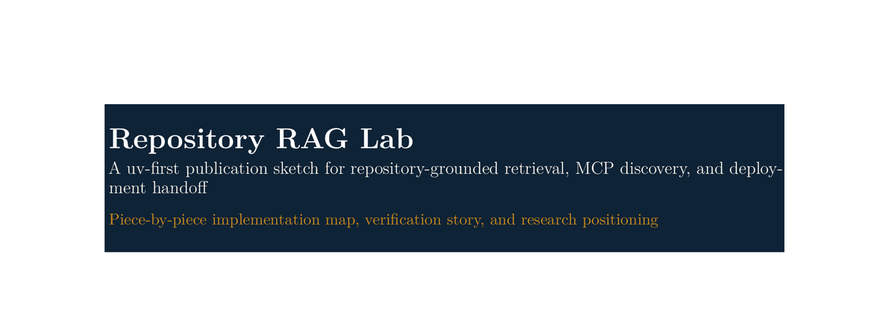

# Repository RAG Lab

[](https://github.com/realagiorganization/dspy_rag_in_repo_docs_and_impl1/actions/workflows/ci.yml)
[](https://github.com/realagiorganization/dspy_rag_in_repo_docs_and_impl1/actions/workflows/publish.yml)
[](https://github.com/realagiorganization/dspy_rag_in_repo_docs_and_impl1/actions/workflows/ci.yml)

[](publication/repository-rag-lab-article.pdf)

This repository is a `uv`-first research lab for repository-grounded Retrieval-Augmented
Generation. Notebooks, the packaged Python CLI, `make` targets, tests, CI, and the Rust wrapper
all share the same implementation so experiments and automation stay aligned.

The Rust wrapper also exposes a compact SQLite lookup path for tracked files, and the default
`make ask` / `uv run repo-rag ask` path now uses that native index first before falling back to
the broader baseline retriever.

## What The Repository Covers

The current scaffold focuses on three connected jobs:

1. Explore in-repo RAG over repository files with a simple baseline retriever plus optional DSPy
   runtime and compiled-program flows.
2. Discover MCP-related artifacts in the repository, submodules, or package manifests.
3. Prepare Azure deployment manifests, validate Azure runtime contracts, and optionally answer
   repository questions through live Azure-backed synthesis.

## Tooling Stance

This repository is intentionally fully `uv`-managed.

- `uv` owns environment sync, locked execution, dependency resolution, builds, and publishing.
- `uv_build` is the Python build backend.
- `make` is a convenience layer over `uv run ...`.
- Pixi is not part of the current toolchain because it would duplicate responsibilities already
  covered by `uv`.

## Quick Start

```bash
curl -LsSf https://astral.sh/uv/install.sh | sh
uv sync --extra azure
make hooks-install
make quality
make ask QUESTION="What does this repository research?"
```

## Publication Draft

The repository now includes a publication-style article that explains the project piece by piece,
from corpus loading and retrieval through MCP discovery, notebook scaffolding, verification, and
the Rust wrapper.

- Read the PDF: [publication/repository-rag-lab-article.pdf](publication/repository-rag-lab-article.pdf)
- Read the bilingual exploratorium: [publication/exploratorium_translation/exploratorium_translation.pdf](publication/exploratorium_translation/exploratorium_translation.pdf)
- Review the tracked file inventory: [FILES.md](FILES.md)
- Review the synced TODO table: [TODO.MD](TODO.MD)
- Refresh the file inventory: `make files-sync`
- Refresh the backlog tables: `make todo-sync`
- Refresh the bilingual exploratorium inventory: `make exploratorium-sync`
- Rebuild it locally: `make paper-build`

## Preferred Workflow Surfaces

| Surface | Preferred command | Purpose |
| --- | --- | --- |
| Utility overview | `make utility-summary` | Show the supported user-facing entrypoints. |
| Direct CLI | `uv run repo-rag utility-summary` | Use the packaged CLI without going through `make`. |
| File inventory sync | `make files-sync` | Regenerate `FILES.md` and `FILES.csv` from the tracked repository tree. |
| Rust lookup index | `make rust-lookup-index` | Build or refresh the ignored SQLite FTS index under `artifacts/sqlite/`. |
| Rust lookup | `make rust-lookup QUERY="dspy training"` | Search tracked file paths and contents locally before `make ask-dspy`. |
| Backlog sync | `make todo-sync` | Regenerate the linkified TODO table in both Markdown and the publication article. |
| Exploratorium sync | `make exploratorium-sync` | Regenerate the bilingual file/link/fetch-state publication inventory. |
| Ask a repo question | `make ask QUESTION="..."` | Run the lookup-first repository-grounded workflow, narrowing to native SQLite file hits before falling back to the broader baseline retriever. |
| DSPy ask | `make ask-dspy QUESTION="..."` | Run the explicit DSPy runtime path with LM config from `DSPY_*`, Azure, or OpenAI environment variables, automatically reusing the latest compiled program when one exists after the same lookup-first narrowing pass. |
| Live Azure ask | `make ask-live QUESTION="..."` | Retrieve repository evidence locally, then synthesize a live answer through Azure OpenAI or Azure AI Inference. |
| DSPy compile | `make dspy-train DSPY_RUN_NAME=...` | Compile and save a repository-grounded DSPy program under `artifacts/dspy/`. |
| DSPy artifact inspect | `make dspy-artifacts` | List saved DSPy runs, the latest compiled program, and recorded benchmark metadata. |
| Retrieval evaluation | `make retrieval-eval` | Measure retrieval quality with pass rate, recall, precision, reciprocal rank, per-tag breakdowns, a top-k sweep, and enforced minimum pass/recall thresholds. |
| MCP discovery | `make discover-mcp` | Inspect MCP-related repository artifacts. |
| Smoke test | `make smoke-test` | Check answer generation, MCP discovery, and Azure manifest output together. |
| Azure OpenAI probe | `make azure-openai-probe` | Validate the Azure OpenAI env contract and run a minimal live chat-completions round trip. |
| Azure Inference probe | `make azure-inference-probe` | Validate and normalize the Azure AI Inference endpoint, then run a minimal live round trip. |
| Surface verification | `make verify-surfaces` | Enforce the Makefile and notebook contract. |
| Notebook batch report | `make notebook-report` | Execute all tracked notebooks with progress output, raw logs, executed copies, and a final report. |
| GitHub run list | `make gh-runs` | List recent GitHub Actions runs through `gh`. |
| GitHub run watch | `make gh-watch` | Watch the latest or selected GitHub Actions run until completion. |
| GitHub failed logs | `make gh-failed-logs` | Print failed job logs for the latest or selected run when CI breaks. |
| Publication PDF | `make paper-build` | Build the LaTeX article PDF and clipped banner image. |
| Exploratorium PDF | `make exploratorium-build` | Build the bilingual exploratorium translation PDF. |
| Notebook research | `make notebook` | Open the main notebook playbook in JupyterLab. |
| Rust wrapper | `cargo run --manifest-path rust-cli/Cargo.toml -- ask --question "..."` | Delegate to the Python workflow, while also exposing native `index` and `lookup` subcommands. |

## Repository Map

| Path | Role |
| --- | --- |
| `src/repo_rag_lab/` | Shared Python package for corpus loading, retrieval, MCP discovery, CLI commands, notebook scaffolds, utilities, and verification helpers. |
| `README.AGENTS.md` | Overarching research narrative that ties together the repository thesis, workflow stages, evidence surfaces, and maintenance contract. |
| `README.DSPY.MD` | Central DSPy map covering corpus planning, training samples, benchmarks, compile-reload flows, notebook scaffolds, and remaining DSPy limitations. |
| `FILES.md` / `FILES.csv` | Generated tracked-file inventories for humans, scripts, and agent maintenance. |
| `notebooks/` | Research playbooks that reuse package helpers for validation, assertions, and logging instead of embedding workflow logic inline. |
| `tests/` | Pytest suites, BDD-style checks, doctests, and surface verification tests. |
| `samples/training/` | Starter question-answer pairs for DSPy-oriented experiments. |
| `samples/population/` | Starter corpus-planning data for staged repository ingestion. |
| `documentation/` | Supporting notes for Azure deployment and inspired external implementations. |
| `publication/` | LaTeX article source, bibliography, committed PDFs, clipped banner image, bilingual exploratorium subdocument, and local build helpers. |
| `todo-backlog.yaml` | Single source of truth for the linkified backlog table rendered into `TODO.MD` and the publication article. |
| `samples/logs/` | Post-push GitHub Actions inspection logs captured with `gh`. |
| `artifacts/` | Generated DSPy program artifacts, Azure manifests, tuning metadata, notebook run logs, and notebook batch-run reports. |
| `rust-cli/` | Rust wrapper that delegates to `uv run repo-rag` and maintains the local SQLite lookup index under `artifacts/sqlite/`. |

## Verification And Quality

The repository treats documentation, notebooks, utilities, and packaging as one workflow. The
main verification entrypoints are:

- `make compile`
- `make lint`
- `make typecheck`
- `make verify-surfaces`
- `make test`
- `make quality`
- `make build`

Git hooks are managed through `pre-commit`:

- `make hooks-install`
- `make hooks-run`
- `make hooks-run-push`

The pre-commit hook stays lightweight with Ruff checks. The pre-push hook runs the heavier
acceptance gates: mypy, basedpyright, retrieval evaluation, pytest with coverage, and
repository-surface verification. The same retrieval gate also runs inside `make quality` and CI.

## Azure Deployment Path

This repository does not fine-tune or deploy a model on its own. It writes deployment metadata
that downstream Azure workflows can consume after a tuned artifact already exists. It now also
includes first-class runtime probes and a live-answer surface for validating the repository's
Azure configuration against the same `uv`-managed CLI.

```bash
make azure-manifest MODEL_ID=my-ft-model DEPLOYMENT_NAME=repo-rag-ft
make azure-openai-probe
make azure-inference-probe
make ask-live QUESTION="What does this repository research?"
```

The manifest lands in `artifacts/azure/` and records the deployment name, endpoint, and required
runtime environment variables.

## Agent Guidance

Repository-local agent instructions live in `AGENTS.md`. Agents and contributors should start with
named `make` targets or `uv run repo-rag ...` commands before inventing one-off workflows so
notebooks, tests, CI, and automation stay aligned. The overreaching repository narrative that
agents are expected to keep current lives in [README.AGENTS.md](README.AGENTS.md). For repo
question answering, `make ask` already uses the Rust lookup path first. Run `make rust-lookup
QUERY="..."` when you want to inspect those candidate files directly before moving to
`make ask-dspy`.

## Post-Push Workflow

After every push:

1. Inspect recent runs with `gh run list --limit 10`.
2. Capture the relevant `gh run view` details.
3. Store the summary in `samples/logs/`.

That step is part of the repository contract, not optional cleanup.
