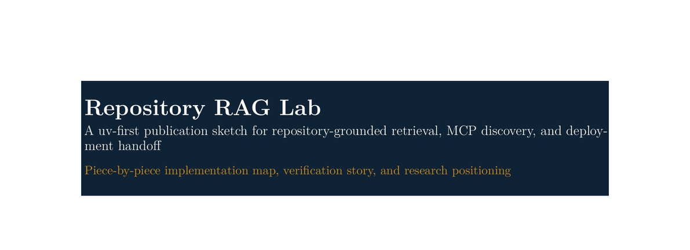

# Repository RAG Lab

[](https://github.com/realagiorganization/dspy_rag_in_repo_docs_and_impl1/actions/workflows/ci.yml)
[](https://github.com/realagiorganization/dspy_rag_in_repo_docs_and_impl1/actions/workflows/publish.yml)
[](https://github.com/realagiorganization/dspy_rag_in_repo_docs_and_impl1/actions/workflows/ci.yml)

[](publication/repository-rag-lab-article.pdf)

This repository is a `uv`-first research lab for repository-grounded Retrieval-Augmented
Generation. Notebooks, the packaged Python CLI, `make` targets, tests, CI, and the Rust wrapper
all share the same implementation so experiments and automation stay aligned.

The Rust wrapper also exposes a compact SQLite lookup path for tracked files, and the default
`make ask` / `uv run repo-rag ask` path now uses that native index first before falling back to
the broader baseline retriever. That lookup-first path now works against arbitrary git repository
roots passed through `--root`, not only this repository itself. The broader retriever now has a
profile-driven optional `idf-rerank` second stage and normalizes corpus paths relative to the
selected repository root, so nested fixture roots and worker-style temporary clones reuse the same
ranking logic cleanly.

## What The Repository Covers

The current scaffold focuses on three connected jobs:

1. Explore in-repo RAG over repository files with a simple baseline retriever plus optional DSPy
   runtime and compiled-program flows.
2. Discover MCP-related artifacts in the repository, submodules, or package manifests.
3. Prepare Azure deployment manifests, validate Azure runtime contracts, and optionally answer
   repository questions through live Azure-backed synthesis.

## Tooling Stance

This repository is intentionally fully `uv`-managed.

- `uv` owns environment sync, locked execution, dependency resolution, builds, and publishing.
- `uv_build` is the Python build backend.
- `make` is a convenience layer over `uv run ...`.
- Pixi is not part of the current toolchain because it would duplicate responsibilities already
  covered by `uv`.

## Quick Start

```bash
curl -LsSf https://astral.sh/uv/install.sh | sh
uv sync --extra azure
make hooks-install
make quality
make ask QUESTION="What does this repository research?"
```

## Publication Draft

The repository now includes a publication-style article that explains the project piece by piece,
from corpus loading and retrieval through MCP discovery, notebook scaffolding, verification, and
the Rust wrapper.

- Read the PDF: [publication/repository-rag-lab-article.pdf](publication/repository-rag-lab-article.pdf)
- Read the bilingual exploratorium: [publication/exploratorium_translation/exploratorium_translation.pdf](publication/exploratorium_translation/exploratorium_translation.pdf)
- Browse the live Pages catalog: <https://realagiorganization.github.io/dspy_rag_in_repo_docs_and_impl1/>
- Review the tracked file inventory: [FILES.md](FILES.md)
- Review the synced TODO table: [TODO.MD](TODO.MD)
- Follow the short local verification walkthrough: [docs/operations/simple-end-to-end-verification-guide.md](docs/operations/simple-end-to-end-verification-guide.md)
- Review the repo hardening plan: [docs/planning/repo-hardening-plan.md](docs/planning/repo-hardening-plan.md)
- Review the `dataset` integration plan: [docs/planning/dataset-integration-plan.md](docs/planning/dataset-integration-plan.md)
- Browse the Pages-ready Markdown catalog locally: `make pages-build` then open `site/index.html`
- Refresh the file inventory: `make files-sync`
- Refresh the backlog tables: `make todo-sync`
- Refresh the bilingual exploratorium inventory: `make exploratorium-sync`
- Rebuild it locally: `make paper-build`

## Preferred Workflow Surfaces

| Surface | Preferred command | Purpose |
| --- | --- | --- |
| Utility overview | `make utility-summary` | Show the supported user-facing entrypoints. |
| Direct CLI | `uv run repo-rag utility-summary` | Use the packaged CLI without going through `make`. |
| File inventory sync | `make files-sync` | Regenerate `FILES.md` and `FILES.csv` from the tracked repository tree. |
| Rust lookup index | `make rust-lookup-index` | Build or refresh the ignored SQLite FTS index under `artifacts/sqlite/`. |
| Rust lookup | `make rust-lookup QUERY="dspy training"` | Search tracked file paths and contents locally before `make ask-dspy`. |
| Backlog sync | `make todo-sync` | Regenerate the linkified TODO table in both Markdown and the publication article. |
| Exploratorium sync | `make exploratorium-sync` | Regenerate the bilingual file-link-fetch-state publication inventory. |
| Pages catalog build | `make pages-build` | Generate and build the MkDocs Material GitHub Pages catalog of tracked Markdown files. |
| Ask a repo question | `make ask QUESTION="..."` | Run the lookup-first repository-grounded workflow with explicit `Question:`, `Answer:`, and `Evidence:` output, narrowing to native SQLite file hits before falling back to the broader baseline retriever. The same path now works for arbitrary git repo roots through `uv run repo-rag ask --root <repo_path> --question "..." --output json`, with optional `--retrieval-mode lexical|idf-rerank` overrides, reserved `--bundle-version` / `--overlay-path` worker hints, and a stable `trace` payload in JSON output. |
| DSPy ask | `make ask-dspy QUESTION="..."` | Run the explicit DSPy runtime path with LM config from `DSPY_*`, Azure, or OpenAI environment variables, automatically reusing the latest compiled program when one exists after the same lookup-first narrowing pass; pair it with `make rust-lookup` when you want to inspect those candidate files directly. Use `uv run repo-rag ask --question "..." --use-dspy --output json` for machine-readable output, bundle-aware trace metadata, and the same optional retrieval-mode override. |
| Live Azure ask | `make ask-live QUESTION="..."` | Retrieve repository evidence locally, then synthesize a live answer through Azure OpenAI or Azure AI Inference. Use `uv run repo-rag ask-live --question "..." --output json` for machine-readable output with the same runtime trace schema. |
| DSPy compile | `make dspy-train DSPY_RUN_NAME=...` | Compile and save a repository-grounded DSPy program under `artifacts/dspy/`. |
| DSPy artifact inspect | `make dspy-artifacts` | List saved DSPy runs, the latest compiled program, the latest bundle manifest, and recorded benchmark metadata. The underlying CLI emits JSON with shared command metadata for worker-side consumption. |
| Bundle inspect | `make bundle-inspect` | Inspect the latest or named versioned DSPy bundle manifest, or inspect a promoted channel explicitly through `BUNDLE_INSPECT_CHANNEL=stable|canary`. When Azure Blob bundle storage is configured, channel resolution prefers the global bundle store over local files. |
| Bundle fetch | `make bundle-fetch BUNDLE_INSPECT_CHANNEL=stable` | Download one promoted or explicitly versioned bundle from the global Azure Blob bundle store into `artifacts/dspy/remote/` so workers can run DSPy from a globally published program instead of a local checkout. |
| Bundle publish | `make bundle-publish BUNDLE_RUN_NAME=...` | Publish a compiled DSPy bundle into the local bundle registry under `artifacts/dspy/published/`, and mirror it to the global Azure Blob bundle container when that store is configured. |
| Bundle promote | `make bundle-promote BUNDLE_CHANNEL=stable BUNDLE_RUN_NAME=...` | Point the `stable` or `canary` channel at a published DSPy bundle version so workers can resolve a promoted runtime instead of guessing “latest run”; the promoted channel is mirrored to Azure Blob when configured. |
| Bundle rollback | `make bundle-rollback BUNDLE_CHANNEL=stable` | Roll a promoted channel back to its previous or explicitly selected published bundle version, including the global Azure Blob channel pointer when configured. |
| Overlay init | `make overlay-init` | Create or refresh a worker-local overlay manifest under `artifacts/overlays/` with retrieval-mode, lookup-index, and trace-directory metadata. |
| Trace export | `make trace-export TRACE_PAYLOAD_PATH=...` | Persist a normalized runtime trace record under `artifacts/traces/` from an ask-family JSON payload so asynchronous optimization does not need to parse ad hoc output later. |
| Trace import | `make trace-import TRACE_PATH=...` | Validate and ingest an external runtime trace record, plus optional outcome metadata, under `artifacts/traces/imported/` for later global optimization work. |
| Trace enqueue | `make trace-enqueue TRACE_PATH=... TRACE_QUEUE_NAME=dataset` | Stage a normalized runtime trace record plus optional outcome metadata for later trainer-side ingestion. When Azure Blob + Queue is configured the record is uploaded to the global trace container and a queue message is emitted; otherwise the same command falls back to the local filesystem queue under `artifacts/traces/queued/`. |
| Trace drain | `make trace-drain TRACE_QUEUE_NAME=dataset` | Drain trainer-side trace handoff items into `artifacts/traces/imported/`. When Azure Blob + Queue is configured the trainer consumes the global queue first; otherwise it drains the local filesystem queue. |
| Trainer candidates | `make trainer-candidates` | Materialize trainer-side YAML candidate examples plus a JSON summary from imported trace records under `artifacts/trainer/` for later DSPy review or compilation. |
| Trainer recompile | `make trainer-recompile TRAINER_RECOMPILE_RUN_NAME=trainer-auto` | Merge the base training set with cumulative trainer-side candidates, write `artifacts/trainer/generated-training.yaml`, and compile a fresh DSPy run from that generated corpus. |
| Trainer cycle | `make trainer-cycle TRACE_QUEUE_NAME=dataset` | Run one background-compatible trainer pass: drain queued traces, evaluate retrieval gates, optionally recompile from trainer-side candidates, and only publish/promote a candidate bundle when both retrieval and DSPy benchmark gates pass. |
| Trainer service | `make trainer-service TRACE_QUEUE_NAME=dataset TRAINER_SERVICE_MAX_IDLE_CYCLES=1` | Run a long-lived trainer/publisher loop that repeatedly executes `trainer-cycle`, writes service state under `artifacts/trainer/`, and keeps queue draining plus gated publish/promotion outside the worker hot path. |
| Trainer manifests | `make trainer-k8s-manifests TRAINER_K8S_IMAGE=... TRACE_QUEUE_NAME=dataset` | Materialize Kubernetes manifests for the `trainer-service` Deployment and `trainer-cycle` CronJob, using one shared runtime image, Azure Blob + Queue for the global bundle/trace bus, and a trainer-local PVC for service state, generated candidates, and cached artifacts. |
| Retrieval evaluation | `make retrieval-eval` | Measure retrieval quality with pass rate, recall, precision, reciprocal rank, per-tag breakdowns, a top-k sweep, and enforced minimum pass/recall thresholds. The underlying CLI emits JSON with shared command metadata for worker-side consumption. |
| MCP discovery | `make discover-mcp` | Inspect MCP-related repository artifacts. |
| MCP server | `make serve-mcp` | Expose a bounded stdio MCP server for short calls only: lightweight baseline ask, bundle status, DSPy artifact listing, and queued trace publish. Heavy DSPy training and full retrieval evaluation intentionally stay on direct CLI surfaces. |
| Smoke test | `make smoke-test` | Check answer generation, MCP discovery, and Azure manifest output together. |
| Azure OpenAI probe | `make azure-openai-probe` | Validate the Azure OpenAI env contract and run a minimal live chat-completions round trip. |
| Azure Inference probe | `make azure-inference-probe` | Validate and normalize the Azure AI Inference endpoint, then run a minimal live round trip. |
| Surface verification | `make verify-surfaces` | Enforce the Makefile and notebook contract. |
| Notebook batch report | `make notebook-report` | Execute all tracked notebooks with progress output, raw logs, executed copies, and a final report. |
| GitHub run list | `make gh-runs` | List recent GitHub Actions runs through `gh`. |
| GitHub run watch | `make gh-watch` | Watch the latest or selected GitHub Actions run until completion. |
| GitHub failed logs | `make gh-failed-logs` | Print failed job logs for the latest or selected run when CI breaks. |
| PR gate sync | `make github-pr-gates` | Apply the required GitHub status checks for `master` pull request merges through `gh`. |
| Publication PDF | `make paper-build` | Build the LaTeX article PDF and clipped banner image. |
| Exploratorium PDF | `make exploratorium-build` | Build the bilingual exploratorium translation PDF. |
| Notebook research | `make notebook` | Open the main notebook playbook in JupyterLab. |
| Rust wrapper | `cargo run --manifest-path rust-cli/Cargo.toml -- ask --question "..."` | Delegate to the Python workflow, while also exposing native `index` and `lookup` subcommands. |

## Repository Map

| Path | Role |
| --- | --- |
| `src/repo_rag_lab/` | Shared Python package for corpus loading, retrieval, bundle/overlay manifests, MCP discovery, CLI commands, notebook scaffolds, utilities, and verification helpers. |
| `docs/architecture/research-narrative.md` | Overarching research narrative that ties together the repository thesis, workflow stages, evidence surfaces, and maintenance contract. |
| `docs/architecture/dspy-rag-guide.md` | Central DSPy map covering corpus planning, training samples, benchmarks, compile-reload flows, notebook scaffolds, and remaining DSPy limitations. |
| `docs/operations/` | Operator-facing runtime, environment, verification, Azure, and trainer deployment guidance. |
| `docs/operations/runtime-image.md` | Runtime image contract for preinstalling `repo-rag` into trainer and worker containers. |
| `docs/planning/` | Execution plans for repo hardening and downstream `dataset` integration. |
| `docs/audit/` | Dated local verification evidence; start at `docs/audit/README.md` and the newest note before claiming repository health. |
| `docs/operations/trainer-deployment.md` | AKS/Kubernetes deployment notes for the trainer-side service and CronJob roles. |
| `FILES.md` / `FILES.csv` | Generated tracked-file inventories for humans, scripts, and agent maintenance. |
| `notebooks/` | Research playbooks that reuse package helpers for validation, assertions, and logging instead of embedding workflow logic inline. |
| `tests/` | Pytest suites, BDD-style checks, doctests, and surface verification tests. |
| `samples/training/` | Starter question-answer pairs for DSPy-oriented experiments. |
| `samples/population/` | Starter corpus-planning data for staged repository ingestion. |
| `docs/` | Architecture, operations, guides, planning docs, and audit evidence. |
| `publication/` | LaTeX article source, bibliography, committed PDFs, clipped banner image, bilingual exploratorium subdocument, and local build helpers. |
| `mkdocs.yml` | MkDocs Material configuration for the public GitHub Pages Markdown catalog. |
| `todo-backlog.yaml` | Single source of truth for the linkified backlog table rendered into `TODO.MD` and the publication article. |
| `samples/logs/` | Post-push GitHub Actions inspection logs captured with `gh`. |
| `artifacts/` | Generated DSPy program artifacts, Azure manifests, tuning metadata, notebook run logs, and notebook batch-run reports. |
| `rust-cli/` | Rust wrapper that delegates to `uv run repo-rag` and maintains the local SQLite lookup index under `artifacts/sqlite/` for whichever git repo root is selected. |

## Verification And Quality

The repository treats documentation, notebooks, utilities, and packaging as one workflow. The
main verification entrypoints are:

- `make ask QUESTION="What does this repository research?"`
- `make compile`
- `make smoke-test`
- `make lint`
- `make typecheck`
- `make verify-surfaces`
- `make test`
- `make quality`
- `make build`

Git hooks are managed through `pre-commit`:

- `make hooks-install`
- `make hooks-run`
- `make hooks-run-push`

The pre-commit hook stays lightweight with Ruff checks. The pre-push hook runs the heavier
acceptance gates: mypy, basedpyright, retrieval evaluation, pytest with coverage, and
repository-surface verification. The same retrieval gate also runs inside `make quality` and CI.

## Azure Deployment Path

This repository does not fine-tune or deploy a model on its own. It writes deployment metadata
that downstream Azure workflows can consume after a tuned artifact already exists. It now also
includes first-class runtime probes and a live-answer surface for validating the repository's
Azure configuration against the same `uv`-managed CLI.

Current central inference decision: keep inference external first, using Azure OpenAI or Azure AI
Inference as the shared model layer for both workers and trainer-side recompilation. A shared
internal inference service remains a later optimization only if cost, latency, or compliance
pressure justifies replacing that external contract.

```bash
make azure-manifest MODEL_ID=my-ft-model DEPLOYMENT_NAME=repo-rag-ft
make azure-openai-probe
make azure-inference-probe
make ask-live QUESTION="What does this repository research?"
uv run repo-rag ask --question "What does this repository research?" --output json
```

The manifest lands in `artifacts/azure/` and records the deployment name, endpoint, and required
runtime environment variables. The machine-readable CLI surfaces now share a first-pass worker
envelope with `command`, `command_status`, `warnings`, and `artifact_metadata` before the
command-specific payload fields. Ask-family JSON output now also carries a stable `trace` object,
while DSPy runs expose a versioned `bundle.json` and workers can pre-create a local
`artifacts/overlays/<name>/overlay.json` manifest before answering. The same worker-side contract
now also includes:

The bounded Azure OpenAI validation path is now confirmed locally against a real `gpt-5.4`
deployment with:

- `AZURE_OPENAI_ENDPOINT=https://gpt45standard.openai.azure.com/`
- `AZURE_OPENAI_DEPLOYMENT_NAME=gpt-5.4`
- `AZURE_OPENAI_API_VERSION=2024-12-01-preview`

The probe path now prefers `max_completion_tokens` for newer GPT-5-class chat-completions
deployments and falls back to `max_tokens` only when the model rejects the newer parameter.

- `repo-rag bundle-inspect --channel stable --output json` to resolve the currently promoted bundle
  for worker startup, preferring the global Azure Blob bundle store when configured
- `repo-rag bundle-fetch --channel stable --output json` to pull that promoted bundle into
  `artifacts/dspy/remote/` for worker-side DSPy execution
- `repo-rag bundle-publish` to persist a compiled bundle into the local published-bundle registry
  and mirror it to the global Azure Blob bundle container when configured
- `repo-rag bundle-promote` and `repo-rag bundle-rollback` to manage the `stable` and `canary`
  channel pointers
- `repo-rag trace-export` to persist a normalized trace record from an ask-family JSON payload
- `repo-rag trace-import` to ingest an external trace record, plus optional outcome metadata, into the local trace store
- `repo-rag trace-enqueue` to stage that trace and outcome metadata into a trainer-side queue for
  later asynchronous drain/import, preferring Azure Blob + Queue as the global transport and
  falling back to the local filesystem queue only when global storage is absent
- `repo-rag trace-drain` to consume those queued handoff items once a background trainer loop is
  ready
- `repo-rag trainer-candidates` to turn imported trace records into trainer-side YAML candidate
  examples plus a summary manifest under `artifacts/trainer/`
- `repo-rag trainer-recompile` to merge the base repository training set with those cumulative
  trainer-side candidates, write `artifacts/trainer/generated-training.yaml`, and compile a fresh
  DSPy run from that generated corpus
- `repo-rag trainer-cycle` to combine queue drain, retrieval gating, and optional bundle
  publish/promotion in one cron/Kubernetes-job-friendly pass while also refreshing the cumulative
  trainer-side candidate-example file and, when configured, recompiling a fresh DSPy run from the
  generated merged training set; the cycle now also enforces a trainer-side DSPy benchmark gate
  before publishing or promoting an automatically recompiled bundle
- `repo-rag trainer-service` to keep that same queue/publish/promote loop alive as a long-running
  trainer-side service while recording state and per-cycle history under `artifacts/trainer/`

## Trainer Deployment Path

The trainer-side runtime is now packaged as a repo-native Kubernetes surface as well:

```bash
make trainer-k8s-manifests \
  TRAINER_K8S_IMAGE=ghcr.io/realagiorganization/repo-rag-lab:latest \
  TRACE_QUEUE_NAME=dataset
```

That command materializes:

- a ServiceAccount
- a ConfigMap
- a Secret example
- a PVC manifest for trainer-side local artifacts
- a `trainer-service` Deployment
- a `trainer-cycle` CronJob

under `artifacts/kubernetes/`. The intent is one shared image family, separate worker vs.
trainer roles, Azure Blob + Queue as the global transport for traces and promoted bundles, a
trainer-local PVC for cache/state/history, and externalized Azure/OpenAI credentials. The older
same-namespace shared-PVC queue path remains compatibility-only and is no longer the primary
deployment story.

The repository also now ships its own runtime image definition in the root [Dockerfile](Dockerfile).
That image keeps an editable checkout under `/workspace/repo-rag`, exposes `repo-rag` on `PATH`,
and is intended to be built and pushed by `../dataset/build_and_push_images.sh` as
`repo-rag-runtime`, then reused directly for trainer pods and as the base image for the
`prompt-executor` worker image.

## Agent Guidance

Repository-local agent instructions live in `AGENTS.md`. Agents and contributors should start with
named `make` targets or `uv run repo-rag ...` commands before inventing one-off workflows so
notebooks, tests, CI, and automation stay aligned. The overreaching repository
[research narrative](docs/architecture/research-narrative.md) should stay current as those
surfaces evolve. For repo
question answering, `make ask` already uses the Rust lookup path first. Run `make rust-lookup
QUERY="..."` when you want to inspect those candidate files directly before moving to
`make ask-dspy`. Retrieval weighting now also has a repo-local profile surface in
`config/retrieval-profile.json`, so repository-specific ranking tweaks no longer have to stay
hardcoded inside `src/repo_rag_lab/retrieval.py`. The retrieval stack now also supports a
profile-selected `idf-rerank` mode and stores corpus paths relative to the selected `--root`,
which keeps temporary worker clones and nested fixture repositories aligned with the same runtime
contract. The same worker-side contract now also includes versioned bundle inspection through
`make bundle-inspect`, explicit bundle publish/promotion/rollback through `make bundle-publish`,
`make bundle-promote`, and `make bundle-rollback`, overlay creation through `make overlay-init`,
runtime traces embedded in JSON ask outputs, explicit trace export/import surfaces, and queued
trace handoff surfaces through `make trace-enqueue` and `make trace-drain` for later
asynchronous optimization loops. Trainer-side orchestration now also has both `make trainer-cycle`
for one-shot background passes and `make trainer-service` for a long-lived poller that keeps
state/history artifacts under `artifacts/trainer/`. Imported traces can also now be materialized
into cumulative candidate examples for future DSPy review through `make trainer-candidates`, then
merged back into `artifacts/trainer/generated-training.yaml` for automatic recompilation through
`make trainer-recompile` or the recompile-aware `make trainer-cycle` / `make trainer-service`
surfaces. Those automated trainer surfaces now also expose a bundle-benchmark gate, so a
recompiled bundle is not published or promoted purely because the retrieval gate passed.

## Post-Push Workflow

After every push:

1. Inspect recent runs with `gh run list --limit 10`.
2. Capture the relevant `gh run view` details.
3. Store the summary in `samples/logs/`.

That step is part of the repository contract, not optional cleanup.
