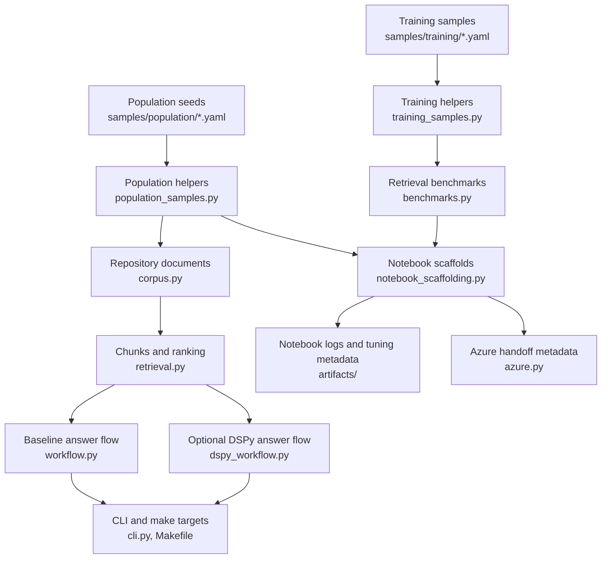

# DSPy Guide For This Repository

This file centralizes the repository's DSPy-related code, data, notebooks, tests, and workflow
surfaces. Use it as the main map for how repository content becomes retrieval context, how
training and evaluation samples are prepared, how the optional DSPy execution path works today,
and how the `codex exec` runtime is being moved from coarse prompt-time augmentation toward the
family-first proxy/runtime contract under
[docs/planning/family-first-mipro-runtime-contract.md](../planning/family-first-mipro-runtime-contract.md).

## Table Of Contents

- [Current Reality](#current-reality)
- [Fast Start](#fast-start)
- [End-To-End Map](#end-to-end-map)
- [Stage 1. Corpus Planning And Data Collection](#stage-1-corpus-planning-and-data-collection)
- [Stage 2. Repository Loading And Retrieval Baseline](#stage-2-repository-loading-and-retrieval-baseline)
- [Stage 3. Training Sample Preparation](#stage-3-training-sample-preparation)
- [Stage 4. Benchmark-Driven Development](#stage-4-benchmark-driven-development)
- [Stage 5. Optional DSPy Execution Path](#stage-5-optional-dspy-execution-path)
- [Stage 6. Notebook Automation And Artifacts](#stage-6-notebook-automation-and-artifacts)
- [Stage 7. Deployment Handoff, Not In-Repo Fine-Tuning](#stage-7-deployment-handoff-not-in-repo-fine-tuning)
- [Stage 8. Verification And Tests](#stage-8-verification-and-tests)
- [Current Gap And Direct Extension Path](#current-gap-and-direct-extension-path)
- [Cross-Reference Index](#cross-reference-index)

## Current Reality

The repository now has both an optional DSPy runtime path and a real compile-save-reload DSPy
program path.

The active target contract for the `codex exec` runtime is now narrower and more explicit than the
older “inject one helpful repo block” model:

- `codex exec` stays the primary orchestrator
- the proxy must inspect every outbound Codex turn, not only the initial user prompt
- the proxy must first rewrite `original_prompt` into `reformulated_prompt`
- the proxy compares the prompt against all family fathers and routes by the best match
- DSPy mediation is allowed only when the current turn has father-backed prompt-family support for
  that `reformulated_prompt`
- unsupported turns pass through unchanged but still become trainer candidates
- the active metrics are only:
  - `hits / total`
  - binary belongs / does-not-belong family decision
  - best father similarity across all families
- per-turn traces are accumulated locally and handed off as one batch after the run finishes
- one published bundle still exists, but the target internal shape is now a family registry with
  one routing `father` plus one DSPy runtime artifact per family
- the local repo now already compiles one family-scoped DSPy artifact per persisted family,
  includes those artifacts in bundle metadata, downloads them with remote bundle fetch, and lets
  the proxy execute the matched family artifact with `original_prompt`, `reformulated_prompt`, and
  `command_trace`
- family state now carries a `family_needs_recompile` flag, so trainer-side family artifact
  compilation can reuse clean-family runtime artifacts from the previous registry instead of
  recompiling every family on every trainer run
- Azure family-state fetch/upload now treats `repo-rag-training-families` as the primary remote
  container and `family-state.json` as the only actively written versioned blob; older
  `champion-index.json` snapshots are still accepted as legacy read input during the rollout
- the same remote family-state upload now also mirrors one `family.json` blob per prompt family
  under `versions/<family_state_version>/families/<prompt_family_id>/`, so the remote family
  container already exposes versioned family directories even before the full replay-set layout
  exists
- dataset / AKS workflow and deploy surfaces now propagate that same family-state container
  contract through workflow env, generated storage secrets, bootstrap shell scripts, and
  `.env.example`, and those deploy/bootstrap surfaces no longer emit champion-named container env
  aliases
- repo-side Azure artifact config resolution now also ignores champion-named container env vars,
  so family-state container lookup comes only from family-state env names or the
  `repo-rag-training-families` default
- remote family-state upload/fetch payloads now emit only family-state fields, even though the
  older `champion-index.json` snapshot format is still readable through compatibility fallback
- newly written remote `current.json` family-state snapshots now also omit champion-named lineage
  fields, while fetch still understands older snapshots that contain them
- trainer-candidate summaries and pending-recompile payloads now also emit only family-state
  fields; the active local/output contract no longer mirrors `champion-index.json`
- explicit `champion_*` Azure/blob wrapper helpers have now been removed from the repo API
  surface; remaining compatibility lives in fallback reads instead
- trainer can now also carry the latest compatible global DSPy `program.json` forward when the
  compile-facing training and benchmark example signatures still match the previous metadata, so
  dirty-family cycles no longer automatically pay for another global compile when only family-local
  runtime artifacts changed; metadata that predates those signatures still requires one
  transitional full compile
- family state now also persists `family_records` replay members directly, so family-scoped
  runtime compilation is no longer limited to one runtime/father summary record; the remote family
  container mirrors those replay members as `records/<snapshot>.json` beside `family.json` and
  `father.json` for each family version directory
- the primary local trainer filename is now `artifacts/trainer/family-state.json`, while
  older local `artifacts/trainer/champion-index.json` snapshots can still be read through the
  migration fallback when `family-state.json` is absent
- trainer-cycle pending-recompile summaries and warning text now also describe the active state as
  `family` drift and `family` candidates, so operator-facing diagnostics no longer present the old
  champion terminology as the primary contract
- proxy now refuses to use a family runtime artifact when its validated bundle `hit_rate` drops
  below the current family baseline, falling back to fresh/global mediation instead of blindly
  trusting any matched family artifact
- worker-side turn-trace batch handoff now rewrites optimistic proxy draft metrics with the final
  run `execution_status`, `acceptance_status`, and real post-run `mediation_metric_hits /
  mediation_metric_total` before those turn traces are exported or queued for trainer ingestion

The repository is still in a compatibility transition. Some persisted paths and helper names still
say `champion`, but the intended product model is now `family state -> father -> family runtime
artifact`, not `family champion as the single truth object`. The deployment and Azure-config
contracts are already family-first; the remaining compatibility layer now lives mainly in legacy
read fallbacks and older stored machine payloads.

Present now:

- [pyproject.toml](../../pyproject.toml) installs `dspy-ai` as part of the main Python package.
- [src/repo_rag_lab/dspy_training.py](../../src/repo_rag_lab/dspy_training.py) resolves LM
  configuration from CLI flags or environment variables, defines the repository-grounded
  `RepositoryRAGProgram`, runs `BootstrapFewShot` or `MIPROv2`, persists artifacts under
  `artifacts/dspy/`, and summarizes saved runs for later reuse.
- [src/repo_rag_lab/dspy_workflow.py](../../src/repo_rag_lab/dspy_workflow.py),
  [src/repo_rag_lab/cli.py](../../src/repo_rag_lab/cli.py), and [Makefile](../../Makefile) expose both
  runtime answering and compiled-program reuse through `ask --use-dspy`, `dspy-train`,
  `dspy-artifacts`, `make ask-dspy`, `make dspy-train`, and `make dspy-artifacts`.
- [src/repo_rag_lab/training_samples.py](../../src/repo_rag_lab/training_samples.py),
  [src/repo_rag_lab/benchmarks.py](../../src/repo_rag_lab/benchmarks.py), and
  [src/repo_rag_lab/notebook_scaffolding.py](../../src/repo_rag_lab/notebook_scaffolding.py) provide
  the data-preparation, evaluation, and artifact-discovery scaffolding used by the training lab.
- [notebooks/03_dspy_training_lab.ipynb](../../notebooks/03_dspy_training_lab.ipynb) and
  [notebooks/04_sample_population_lab.ipynb](../../notebooks/04_sample_population_lab.ipynb) document
  the sample-preparation and corpus-planning flow around that runtime.

Not implemented yet:

- Retrieval below DSPy is no longer lexical-only, but it is still lightweight: the repository now
  supports a profile-driven lexical baseline plus an optional `idf-rerank` second stage from
  [src/repo_rag_lab/retrieval.py](../../src/repo_rag_lab/retrieval.py) and
  [config/retrieval-profile.json](../../config/retrieval-profile.json), so compiled-program quality
  is still bottlenecked by retrieved context quality rather than by missing DSPy compile surfaces.
- The repository persists final program artifacts and metadata, not richer optimizer histories,
  checkpoints, or run comparisons.
- There is still no in-repo model fine-tuning or live deployment step.

Boundary summary:

- DSPy optimization in this repository means compiling and reusing a repository-grounded DSPy
  program plus its bundle metadata.
- Retrieval work in this repository means improving which repository evidence reaches that program.
- Model-level weight tuning remains out of scope here; Azure/OpenAI or a future trainer service may
  consume bundle outputs later, but the repository itself does not mutate base-model weights.

The practical consequence is: this repo already supports corpus planning, training-sample curation,
retrieval benchmarking, optional DSPy runtime answering, compiled-program persistence, saved-program
reloads, and deployment metadata handoff. The next bottleneck is retrieval quality, not the
absence of a DSPy compile path.

## Fast Start

Use the repo-managed surfaces first.

```bash
uv sync --extra azure
make utility-summary
make ask QUESTION="What does this repository research?"
make ask-dspy QUESTION="What does this repository research?" \
  DSPY_MODEL=openai/gpt-4o-mini \
  DSPY_API_KEY="$OPENAI_API_KEY"
make dspy-train DSPY_RUN_NAME=smoke \
  DSPY_MODEL=openai/gpt-4o-mini \
  DSPY_API_KEY="$OPENAI_API_KEY"
make dspy-artifacts
uv run repo-rag ask --question "What does this repository research?" --output json
uv run repo-rag ask --question "What does this repository research?" --use-dspy --output json \
  --dspy-model openai/gpt-4o-mini --dspy-api-key "$OPENAI_API_KEY"
make smoke-test
make verify-surfaces
```

The baseline path above is runnable as-is. The DSPy path can now resolve LM configuration from:

- explicit `--dspy-*` CLI flags
- `DSPY_*` environment variables
- repository Azure variables such as `AZURE_OPENAI_DEPLOYMENT_NAME` and `AZURE_OPENAI_ENDPOINT`
- `OPENAI_API_KEY` for the default OpenAI fallback model

When both `DSPY_*` and generic Azure variables are present, the DSPy runtime prefers
`DSPY_MODEL`. That lets the Codex proxy and trainer use one dedicated helper deployment such as
`DSPY_MODEL=azure/gpt-4.1-mini` while still reusing the shared `AZURE_OPENAI_*` transport values
unless `DSPY_API_BASE`, `DSPY_API_VERSION`, or `DSPY_API_KEY` override them explicitly.

Once a program is compiled, `make ask-dspy` will automatically reuse the latest saved artifact
when LM configuration is available. You can still point the runtime at an explicit saved artifact
directly:

```bash
make ask-dspy QUESTION="What does this repository research?" \
  DSPY_PROGRAM_PATH=artifacts/dspy/smoke/program.json \
  DSPY_MODEL=openai/gpt-4o-mini \
  DSPY_API_KEY="$OPENAI_API_KEY"
```

For downstream worker integration, the key new surface is the shared machine-readable envelope:

- `uv run repo-rag ask --question "..." --output json`
- `uv run repo-rag ask --question "..." --use-dspy --output json ...`
- `uv run repo-rag ask-live --question "..." --output json`
- `uv run repo-rag retrieval-eval --output json`
- `uv run repo-rag dspy-artifacts --output json`
- `uv run repo-rag bundle-inspect --channel stable --output json`
- `uv run repo-rag bundle-fetch --channel stable --output json`
- `uv run repo-rag bundle-publish --run-name <bundle-run> --output json`
- `uv run repo-rag bundle-promote --channel stable --run-name <bundle-run> --output json`
- `uv run repo-rag bundle-rollback --channel stable --output json`
- `uv run repo-rag overlay-init --output json`
- `uv run repo-rag trace-export --payload-path <ask-output.json> --output json`
- `uv run repo-rag trace-import --trace-path <trace-record.json> --outcome-path <outcome.json> --output json`
- `uv run repo-rag trace-enqueue --trace-path <trace-record.json> --queue-name dataset --outcome-path <outcome.json> --output json`
- `uv run repo-rag trace-drain --queue-name dataset --output json`
- `uv run repo-rag trainer-candidates --output json`
- `uv run repo-rag trainer-recompile --run-name trainer-auto --output json`
- `uv run repo-rag trainer-cycle --queue-name dataset --promote-channel canary --run-name <bundle-run> --output json`
- `uv run repo-rag trainer-service --queue-name dataset --poll-interval-seconds 30 --output json`
- `uv run repo-rag trainer-k8s-manifests --image ghcr.io/realagiorganization/repo-rag-lab:latest --output json`
- `uv run repo-rag serve-codex-proxy --root <repo_path> --bundle-root <bundle_root>`

For the containerized `dataset` worker, `codex` now stays the primary executor while
`repo-rag serve-codex-proxy` acts as a transport-level mediation layer in front of Azure Codex
Responses traffic. The current target is no longer “improve only the first prompt”. The target is:

- intercept every outbound Codex request
- extract the latest turn `original_prompt`
- rewrite it into `reformulated_prompt`
- compare the prompt against all family fathers
- run DSPy mediation only for supported reformulated families
- preserve the turn `command_trace` when the step sequence is observable
- record every turn as a per-turn DSPy trace candidate
- batch those traces after the run for trainer ingestion

The target trainer/runtime split for `MIPROv2` is also explicit now:

- online proxy path:
  - reformulate the turn
  - route by family father
  - execute the family's precomputed DSPy runtime artifact
  - pass `original_prompt`, `reformulated_prompt`, and `command_trace` into that family artifact
- offline trainer path:
  - accumulate family replay sets
  - run `MIPROv2` only on dirty families
  - carry clean-family runtime artifacts forward unchanged
  - carry the global DSPy program forward too when the compile-facing merged dataset signature is
    unchanged
  - persist and recover local trainer state primarily through `family-state.json` /
    `remote-family-state`; older `champion-index.json` snapshots remain read-only migration input
  - persist the shared family-state snapshot through the primary remote family-state container
  - mirror one versioned `family.json`, `father.json`, and `records/<snapshot>.json` set per
    family into that same container
  - mirror a current operator-facing view at the container root too: `family-state.json` plus
    `families/<family_id>/...`, so the durable family store is inspectable without walking
    `versions/<family_state_version>/...`
  - rebuild one monolithic bundle containing the family registry
- deployment handoff:
  - dataset / AKS provisioning exports the family-state container as a first-class storage env
  - the same handoff still mirrors champion aliases so older pods/images do not fail mid-rollout
  - workers now also resolve bundle versions directly from the staged
    `.repo_rag_bundle_store` mirror when channel metadata is absent, so live bundle activation is
    no longer blocked on `stable.json` / `published.json` alone
  - deploy-stage bundle staging now also falls back to the latest immutable remote bundle version
    when the stable channel blob is absent, and synthesizes a local `channels/stable.json` pointer
    for the staged worker mirror
  - the live `codex exec` prompt body is now task-first and stripped of Discord scaffolding before
    the execution contract is appended
  - generated AKS env now enables the existing resumed-lane reset policy by default through
    `DATASET_CODEX_MAX_RESUMED_RUNS=3` and
    `DATASET_CODEX_PROMPT_TOKEN_GROWTH_RESET_RATIO=2.0`

The proxy still keeps its token-budget and low-signal suppression behavior for injected developer
messages, but those transport details are subordinate to the per-turn DSPy contract above.

Those JSON surfaces now carry a shared envelope:

- `command`
- `command_status` with `success`, `fail`, or `error`
- `warnings`
- `artifact_metadata` with `input_paths`, `generated_paths`, and `related_paths`

That gives downstream workers a stable contract instead of forcing them to parse the human-readable
`Question:` / `Answer:` / `Evidence:` rendering. Command-specific payload fields still sit beside
that shared envelope. The ask-family payloads now also carry:

- `bundle_version` and `overlay_path` as reserved worker-facing fields
- `trace`, a stable runtime-trace object that can be persisted directly by a future trainer loop
- explicit bundle publish/promote/rollback commands so a future trainer loop can separate
  “compiled bundle exists” from “bundle is promoted for worker use”
- an explicit `bundle-fetch` command so workers can pull the currently promoted DSPy program from
  the global Azure Blob bundle store into a local cache before invoking `ask --use-dspy`
- explicit `trace-export` / `trace-import` commands so the trainer loop can persist and ingest
  those records, plus optional accepted/candidate outcome metadata, without re-parsing
  human-readable output
- explicit `trace-enqueue` / `trace-drain` commands so downstream workers can hand off trace and
  outcome payloads asynchronously through Azure Blob + Queue instead of blocking on synchronous
  trainer-side import; the same commands still fall back to the local filesystem queue for
  single-repository development when global storage is absent
- a `trainer-candidates` command that turns imported traces into cumulative YAML question/answer
  candidates for later DSPy review or compilation
- a `trainer-recompile` command that merges the base training set with those cumulative
  candidate examples, writes `artifacts/trainer/generated-training.yaml`, and compiles a fresh
  DSPy run from the merged corpus; the same trainer path now also treats that generated champion
  set as the benchmark surface for publish gating, while allowing trainer-candidate rows to carry
  their own benchmark context so external prompt families can be evaluated by request/context
  deltas instead of forcing live retrieval against the current repository
- a `trainer-cycle` command that can be wrapped by cron, systemd, or a Kubernetes Job before a
  longer-lived trainer/publisher service exists, while optionally invoking that same
  candidate-to-recompile bridge when LM config is available and enforcing a trainer-side DSPy
  benchmark gate before publish/promotion
- a `trainer-service` command that turns that same lifecycle into a long-running poller with
  persisted state/history artifacts, so the repo now has a concrete asynchronous trainer surface
  before a more specialized deployment package exists; the service aggregate now also counts
  trainer cycles blocked by bundle benchmark gates
- a `trainer-k8s-manifests` command that turns those repo-native trainer surfaces into concrete
  Kubernetes Deployment and CronJob manifests without introducing Docker-in-Docker or a second
  runtime contract
- first-pass trainer-side ingestion summaries on both surfaces, so imported traces now contribute
  acceptance-status, execution-status, retrieval-mode, bundle-version, and empty source/context
  counts instead of being only opaque files on disk

The bounded local validation path now works end-to-end once the full LM contract is present, not
only an API key. On `2026-04-29` the repository validated all of the following against a real
Azure OpenAI `gpt-5.4` deployment:

- `uv run repo-rag azure-openai-probe`
- `uv run repo-rag ask-live --question "What does this repository research?" --provider azure-openai --output json`
- `uv run pytest tests/test_live_azure_integration.py`
- `uv run repo-rag trainer-recompile --run-name trainer-live-check --output json`

`trainer-cycle --recompile-run-name ... --output json` also now performs a live recompilation under
the same Azure config and then blocks publish when the trainer-side DSPy bundle benchmark gate is
not met. A local shell that lacks endpoint/deployment metadata will still skip or fail these live
surfaces even though queue drain and candidate materialization remain available.

Use the notebooks when you want the research-playbook view.

- [notebooks/01_repo_rag_research.ipynb](../../notebooks/01_repo_rag_research.ipynb): baseline
  repository RAG, MCP discovery, smoke test.
- [notebooks/02_agent_workflow_checklist.ipynb](../../notebooks/02_agent_workflow_checklist.ipynb):
  operational checklist for agents.
- [notebooks/03_dspy_training_lab.ipynb](../../notebooks/03_dspy_training_lab.ipynb): training-sample
  inspection plus latest compiled-program inspection and reuse.
- [notebooks/04_sample_population_lab.ipynb](../../notebooks/04_sample_population_lab.ipynb): corpus
  population planning.

## End-To-End Map



Read this flow from left to right:

1. Plan what should enter the corpus.
2. Load repository files as text.
3. Chunk and rank them.
4. Prepare training and benchmark examples.
5. Run the baseline answer path or compile and reuse a DSPy program.
6. Capture notebook-oriented metadata for later tuning and deployment work.

## Stage 1. Corpus Planning And Data Collection

This stage answers: which repository files should matter for DSPy and RAG experiments before any
optimizer is involved?

Primary files:

- [samples/population/repository_population_candidates.yaml](../../samples/population/repository_population_candidates.yaml)
- [src/repo_rag_lab/population_samples.py](../../src/repo_rag_lab/population_samples.py)
- [docs/architecture/package-api.md](package-api.md)
- [docs/architecture/mcp-discovery.md](mcp-discovery.md)
- [notebooks/04_sample_population_lab.ipynb](../../notebooks/04_sample_population_lab.ipynb)

The seed data is a small, ordered YAML list:

```yaml
- source: README.md
  rationale: The root usage guide defines the preferred uv-first workflow and entrypoints.
  priority: 1
- source: AGENTS.md
  rationale: Agent execution rules are part of the intended repository contract.
  priority: 2
```

The preparation flow is:

1. `load_population_candidates(path)` loads the YAML file.
2. `normalize_population_candidates(records)` converts each entry into an immutable
   `PopulationCandidate`.
3. `validate_population_candidates(candidates, root=...)` checks for missing fields, duplicates,
   non-positive priorities, absolute paths, and missing files.
4. `extend_population_candidates(root, candidates)` automatically adds stable documentation surfaces
   that matter for notebook and DSPy work, currently
   [docs/architecture/package-api.md](package-api.md),
   [docs/architecture/mcp-discovery.md](mcp-discovery.md), and discovered submodule docs.
5. `rerank_population_candidates(candidates, source_hits)` can reorder the plan from empirical
   benchmark evidence.

This is already a form of automatic development: the repository can revise corpus priority from
observed retrieval hits instead of keeping the source list purely manual.

Use this snippet when you want the repository to build the population-lab context for you:

```python
from pathlib import Path

from repo_rag_lab.notebook_scaffolding import build_population_lab_context

root = Path(".").resolve()
payload = build_population_lab_context(root)
print(payload["extended_summary"])
print(payload["reranked_sources"])
```

Important cross-reference:

- The output of this stage affects the quality of the file set later loaded by
  [src/repo_rag_lab/corpus.py](../../src/repo_rag_lab/corpus.py).
- The empirical re-ranking input comes from
  [src/repo_rag_lab/benchmarks.py](../../src/repo_rag_lab/benchmarks.py).

## Stage 2. Repository Loading And Retrieval Baseline

This stage turns repository files into the raw context that both the baseline and DSPy-shaped paths
consume.

Primary files:

- [src/repo_rag_lab/corpus.py](../../src/repo_rag_lab/corpus.py)
- [src/repo_rag_lab/retrieval.py](../../src/repo_rag_lab/retrieval.py)
- [src/repo_rag_lab/workflow.py](../../src/repo_rag_lab/workflow.py)
- [src/repo_rag_lab/mcp.py](../../src/repo_rag_lab/mcp.py)
- [notebooks/01_repo_rag_research.ipynb](../../notebooks/01_repo_rag_research.ipynb)

The flow is intentionally simple:

1. `iter_text_files(root)` walks the repository.
2. Only text-like suffixes are kept: `.md`, `.txt`, `.py`, `.rs`, `.toml`, `.yaml`, `.yml`,
   `.json`, `.feature`.
3. Generated and noisy directories are skipped, including `.git`, `.venv`, `artifacts`, `dist`,
   `build`, and cache folders.
4. `load_documents(root)` reads each file into a `RepoDocument` and keeps source paths relative
   to the selected repository root.
5. `chunk_documents(documents, chunk_size=1200)` splits documents into fixed-size text chunks.
6. `retrieve(question, chunks, top_k=4)` uses lexical overlap, path-aware weighting, and an
   optional `idf-rerank` second stage selected through the active retrieval profile or an
   explicit CLI override.
7. `ask_repository(question, root)` renders a deterministic baseline answer with explicit
   `Question:`, `Answer:`, and `Evidence:` sections, citing the most answer-rich retrieved chunks
   plus any MCP candidates.

The baseline retrieval code is small enough to read end-to-end:

```python
documents = load_documents(root)
chunks = chunk_documents(documents)
context = retrieve(question, chunks)
answer = synthesize_answer(question=question, context=context, mcp_servers=mcp_servers)
```

Why this matters for DSPy:

- [src/repo_rag_lab/dspy_workflow.py](../../src/repo_rag_lab/dspy_workflow.py) reuses this exact corpus
  and retrieval machinery.
- Any improvement to corpus cleaning or ranking here improves both the baseline and DSPy paths.
- The notebook and benchmark layers assume this load-chunk-rank contract.

MCP discovery is adjacent to retrieval, not a separate product:

- [src/repo_rag_lab/mcp.py](../../src/repo_rag_lab/mcp.py) scans for `mcp.json`, `.mcp.json`,
  `pyproject.toml`, `Cargo.toml`, and `package.json`.
- The resulting hints are surfaced in baseline answers and workflow notebooks.
- The population stage uses MCP documentation as a source-planning input.
- When a real MCP transport is needed, [src/repo_rag_lab/mcp_server.py](../../src/repo_rag_lab/mcp_server.py)
  now exposes only bounded tools such as lightweight ask, bundle status, artifact listing, and
  queued trace publish; heavy DSPy compilation and retrieval evaluation stay on the direct CLI path.

## Stage 3. Training Sample Preparation

This stage defines the structured examples that can later support DSPy optimization. The checked-in
repository set now spans repo overview, inspired summaries, utility onboarding, package API notes,
Azure runtime guidance, MCP notes, notebook execution, and publication build guidance.

Primary files:

- [samples/training/repository_training_examples.yaml](../../samples/training/repository_training_examples.yaml)
- [src/repo_rag_lab/training_samples.py](../../src/repo_rag_lab/training_samples.py)
- [notebooks/03_dspy_training_lab.ipynb](../../notebooks/03_dspy_training_lab.ipynb)
- [tests/test_training_samples.py](../../tests/test_training_samples.py)

The current checked-in sample file uses question, expected answer, and tags:

```yaml
- question: What does this repository research?
  expected_answer: It researches repository-grounded RAG over repository files.
  tags:
    - repo
    - rag
```

The loader supports a stronger schema than the current starter data uses. Each training example can
also include `expected_sources`, which becomes important for benchmark-driven development:

```yaml
- question: How should agents start with repository utilities?
  expected_answer: >-
    Start with make utility-summary or uv run repo-rag utility-summary, then
    use the named make targets or direct CLI commands.
  tags:
    - agents
    - utilities
  expected_sources:
    - README.md
    - AGENTS.md
```

The preparation flow is:

1. `load_training_examples(path)` reads the YAML.
2. `normalize_training_examples(records)` trims strings and converts mutable input into immutable
   `TrainingExample` values.
3. `validate_training_examples(examples, root=...)` checks for empty fields, duplicate questions,
   duplicate tags, absolute source paths, and missing relative source files.
4. `summarize_training_examples(examples)` reports `example_count`, `benchmark_count`, questions,
   and unique tags.
5. `batch_training_examples(examples, batch_size=2)` groups the examples into small review units.

This is the notebook-facing snippet used in the training lab:

```python
from pathlib import Path

from repo_rag_lab.notebook_support import resolve_repo_root
from repo_rag_lab.training_samples import (
    batch_training_examples,
    load_training_examples,
    summarize_training_examples,
)

root = resolve_repo_root(Path.cwd().resolve())
examples = load_training_examples(
    root / "samples" / "training" / "repository_training_examples.yaml"
)
print(summarize_training_examples(examples))
print(batch_training_examples(examples, batch_size=2))
```

Important cross-reference:

- These same examples feed [src/repo_rag_lab/benchmarks.py](../../src/repo_rag_lab/benchmarks.py).
- The notebook scaffolds in
  [src/repo_rag_lab/notebook_scaffolding.py](../../src/repo_rag_lab/notebook_scaffolding.py) load and
  validate them automatically.

## Stage 4. Benchmark-Driven Development

This stage is the strongest current approximation of automatic DSPy program development in the repo.
It does not compile a DSPy program yet, but it does turn structured examples into measurable
retrieval evidence.

Primary files:

- [src/repo_rag_lab/benchmarks.py](../../src/repo_rag_lab/benchmarks.py)
- [src/repo_rag_lab/notebook_support.py](../../src/repo_rag_lab/notebook_support.py)
- [src/repo_rag_lab/notebook_scaffolding.py](../../src/repo_rag_lab/notebook_scaffolding.py)
- [notebooks/03_dspy_training_lab.ipynb](../../notebooks/03_dspy_training_lab.ipynb)
- [notebooks/04_sample_population_lab.ipynb](../../notebooks/04_sample_population_lab.ipynb)

The benchmark loop is:

1. `build_retrieval_benchmarks(examples)` keeps only training examples that declare
   `expected_sources`.
2. `evaluate_retrieval_benchmarks(root, benchmarks)` runs retrieval against a fairness-filtered
   corpus, while `evaluate_retrieval_quality_suite(...)` sweeps multiple `top_k` values over the
   same benchmark set.
3. The benchmark corpus explicitly excludes noisy or leaking paths such as `.codex`, `.github`,
   `tests`, `data`, `samples/training`, `samples/logs`, `docs/architecture/research-narrative.md`, `FILES.md`, `docs/operations/environment.md`,
   `TODO.MD`, `todo-backlog.yaml`, `AGENTS.md.d/`, and generated exploratorium manifests.
4. Each result records `retrieved_sources`, `matched_sources`, missed sources, first relevant rank,
   reciprocal rank, source recall, source precision, and tags.
5. `summarize_benchmark_results(results)` computes pass counts, pass rate, full-coverage rate,
   mean recall, mean precision, mean reciprocal rank, per-source hit counters, and per-tag
   rollups so notebook and CLI users can see which retrieval slices regress.
6. `assert_minimum_pass_rate(summary, minimum_pass_rate=2 / 3)` can fail a notebook run when the
   retrieval surface regresses, while the shared threshold helpers in
   [src/repo_rag_lab/benchmarks.py](../../src/repo_rag_lab/benchmarks.py) now power the CLI and CI gate
   too.
7. The source-hit summary can feed
   `rerank_population_candidates(...)` in
   [src/repo_rag_lab/population_samples.py](../../src/repo_rag_lab/population_samples.py).
8. `make retrieval-eval` and `uv run repo-rag retrieval-eval` expose the same evaluation suite as a
   user-facing utility surface, and the repo defaults now enforce `minimum_pass_rate=1.0` plus
   `minimum_source_recall=1.0` so regressions fail in `make quality`, pre-push, and CI.
   The same utility now emits shared command metadata in its JSON payload so downstream callers
   can treat it as a stable machine-readable contract instead of an ad hoc blob.
9. The live full-corpus retriever in [src/repo_rag_lab/retrieval.py](../../src/repo_rag_lab/retrieval.py)
   now also guards against a different class of regressions: test files, training samples, audit
   notes, generated inventories, and summary overlays should not outrank primary docs when the user
   is asking which file to read or where a concept is documented.

Use this when you want a compact benchmark report:

```python
from pathlib import Path

from repo_rag_lab.benchmarks import (
    build_retrieval_benchmarks,
    evaluate_retrieval_quality_suite,
)
from repo_rag_lab.training_samples import load_training_examples

root = Path(".").resolve()
examples = load_training_examples(
    root / "samples" / "training" / "repository_training_examples.yaml"
)
benchmarks = build_retrieval_benchmarks(examples)
suite = evaluate_retrieval_quality_suite(root, benchmarks, top_k=4, top_k_values=(1, 2, 4, 8))
print(suite["default_summary"]["pass_rate"])
print(suite["default_summary"]["average_reciprocal_rank"])
print(suite["top_k_summaries"])
```

Why this is the key development stage:

- It produces measurable evidence before any DSPy optimizer work begins.
- It can automatically tell you which repository files are actually helping retrieval.
- It generates the benchmark summary later written into tuning metadata by
  [src/repo_rag_lab/azure.py](../../src/repo_rag_lab/azure.py).

## Stage 5. Optional DSPy Execution Path

This stage now covers both the direct DSPy runtime path and the compile-save-reload lifecycle.

Primary files:

- [src/repo_rag_lab/dspy_training.py](../../src/repo_rag_lab/dspy_training.py)
- [src/repo_rag_lab/dspy_workflow.py](../../src/repo_rag_lab/dspy_workflow.py)
- [src/repo_rag_lab/cli.py](../../src/repo_rag_lab/cli.py)
- [Makefile](../../Makefile)
- [tests/test_dspy_training.py](../../tests/test_dspy_training.py)
- [tests/test_cli_and_dspy.py](../../tests/test_cli_and_dspy.py)
- [docs/architecture/inspired/dspy-rag-tutorial.md](inspired/dspy-rag-tutorial.md)
- [docs/architecture/inspired/implementing-rag-with-dspy-technical-guide.md](inspired/implementing-rag-with-dspy-technical-guide.md)

The runtime flow is now:

```python
lm_config = resolve_dspy_lm_config(...)
runtime = RepositoryRAG(
    root=Path(".").resolve(),
    top_k=4,
    program_path=Path("artifacts/dspy/smoke/program.json"),
    lm_config=lm_config,
    require_configured_lm=True,
)
result = runtime("What does this repository research?")
print(result.answer)
```

1. [src/repo_rag_lab/cli.py](../../src/repo_rag_lab/cli.py) parses either `repo-rag ask --use-dspy`
   or `repo-rag dspy-train`.
2. `resolve_dspy_lm_config(...)` maps explicit flags or environment variables into a typed DSPy LM
   config.
3. `RepositoryRAG(...)` either builds a fresh runtime program, auto-loads the latest compiled
   program, or loads `--dspy-program-path` from disk.
4. [src/repo_rag_lab/dspy_training.py](../../src/repo_rag_lab/dspy_training.py) validates the training
   examples, builds a DSPy trainset, compiles a `RepositoryRAGProgram`, writes
   `artifacts/dspy/<run-name>/program.json`, and records `metadata.json`.
5. `RepositoryRAGProgram` still retrieves context through
   [src/repo_rag_lab/corpus.py](../../src/repo_rag_lab/corpus.py) and
   [src/repo_rag_lab/retrieval.py](../../src/repo_rag_lab/retrieval.py), with repo-local weighting
   loaded from [config/retrieval-profile.json](../../config/retrieval-profile.json), so DSPy
   changes the answer-generation and compile layers without replacing the current retriever.

The user-facing commands are:

```bash
make ask-dspy QUESTION="What does this repository research?" \
  DSPY_MODEL=openai/gpt-4o-mini \
  DSPY_API_KEY="$OPENAI_API_KEY"

make dspy-train DSPY_RUN_NAME=smoke \
  DSPY_MODEL=openai/gpt-4o-mini \
  DSPY_API_KEY="$OPENAI_API_KEY"

make dspy-artifacts

make ask-dspy QUESTION="What does this repository research?" \
  DSPY_PROGRAM_PATH=artifacts/dspy/smoke/program.json \
  DSPY_MODEL=openai/gpt-4o-mini \
  DSPY_API_KEY="$OPENAI_API_KEY"
```

Important limitation:

- The compile path now exists, but it still sits on the repository's lexical retriever.
- A saved program still needs an LM configured at runtime before it can answer.
- The repository now persists `program.json`, `metadata.json`, and a versioned `bundle.json`, but
  it still does not keep richer optimizer histories or experiment-comparison dashboards.
- The worker-local overlay format exists, but it currently tracks retrieval and trace state rather
  than local model weights.
- Trace export/import surfaces now exist, but no global trainer or bundle-promotion workflow uses
  them yet.
- The inspired notes under [docs/architecture/inspired/](inspired/) still matter because
  retrieval and evaluation depth remain the next meaningful extension surface.

## Stage 6. Notebook Automation And Artifacts

The notebooks still do not carry core logic inline. They orchestrate tested helpers from `src/`
and now also surface the latest compiled DSPy artifact when one exists.

Primary files:

- [src/repo_rag_lab/notebook_support.py](../../src/repo_rag_lab/notebook_support.py)
- [src/repo_rag_lab/notebook_scaffolding.py](../../src/repo_rag_lab/notebook_scaffolding.py)
- [notebooks/01_repo_rag_research.ipynb](../../notebooks/01_repo_rag_research.ipynb)
- [notebooks/02_agent_workflow_checklist.ipynb](../../notebooks/02_agent_workflow_checklist.ipynb)
- [notebooks/03_dspy_training_lab.ipynb](../../notebooks/03_dspy_training_lab.ipynb)
- [notebooks/04_sample_population_lab.ipynb](../../notebooks/04_sample_population_lab.ipynb)

Notebook support responsibilities:

- `resolve_repo_root(...)` keeps notebook paths stable.
- `configure_notebook_logger(...)` provides lightweight notebook logging.
- `assert_no_validation_issues(...)` fails fast on broken sample files.
- `assert_minimum_pass_rate(...)` fails fast on benchmark regressions.
- `write_notebook_run_log(...)` stores structured notebook outputs under `artifacts/notebook_logs/`.

Notebook scaffolding responsibilities:

- `build_agent_workflow_context(root)` combines training validation, benchmark summary, MCP counts,
  and population validation into one payload.
- `build_training_lab_context(root)` loads training data, evaluates benchmarks, writes tuning
  metadata, and surfaces the latest compiled DSPy artifact metadata when one exists.
- `build_population_lab_context(root)` extends and reranks the corpus plan from benchmark evidence.

This is the most compact automatic training-lab entrypoint in the repo today:

```python
from pathlib import Path

from repo_rag_lab.notebook_scaffolding import build_training_lab_context

root = Path(".").resolve()
payload = build_training_lab_context(root)
print(payload["training_summary"])
print(payload["benchmark_summary"])
print(payload["tuning_metadata_path"])
print(payload["compiled_program_path"])
```

That single call crosses these modules in sequence:

1. [src/repo_rag_lab/training_samples.py](../../src/repo_rag_lab/training_samples.py)
2. [src/repo_rag_lab/benchmarks.py](../../src/repo_rag_lab/benchmarks.py)
3. [src/repo_rag_lab/dspy_training.py](../../src/repo_rag_lab/dspy_training.py)
4. [src/repo_rag_lab/azure.py](../../src/repo_rag_lab/azure.py)

[notebooks/03_dspy_training_lab.ipynb](../../notebooks/03_dspy_training_lab.ipynb) keeps the research
playbook shape:

1. load training helpers
2. summarize the training set
3. build notebook-friendly batches
4. inspect or reuse the latest compiled program
5. assert benchmark health and log the run

The notebook deliberately does not kick off a live optimizer run by default, because that would
hide network cost and credential requirements inside notebook execution.

## Stage 7. Deployment Handoff, Not In-Repo Fine-Tuning

The repository records deployment-oriented metadata, but it does not run Azure fine-tuning or
deployment itself.

Primary files:

- [src/repo_rag_lab/azure.py](../../src/repo_rag_lab/azure.py)
- [docs/operations/azure-deployment.md](../operations/azure-deployment.md)
- [artifacts/azure/](../../artifacts/azure/)

There are two related artifact writers:

- `write_deployment_manifest(...)` writes a deployment manifest under `artifacts/azure/`.
- `write_tuning_run_metadata(...)` writes notebook-oriented tuning metadata under
  `artifacts/azure/tuning/`.

The direct CLI surface is:

```bash
uv run repo-rag azure-manifest \
  --model-id my-ft-model \
  --deployment-name repo-rag-ft \
  --endpoint https://example.services.ai.azure.com/models
```

Why this section belongs in the DSPy guide:

- The training-lab scaffold writes tuning metadata here after benchmark evaluation.
- The inspired DSPy workflow documents assume a later stage where a tuned program or fine-tuned
  model must be handed to deployment automation.
- The repo keeps that handoff explicit instead of pretending notebook experiments are deployment.

## Stage 8. Verification And Tests

DSPy-related behavior is spread across package code, notebooks, utilities, and packaging surfaces,
so the verification story is also multi-surface.

Primary tests:

- [tests/test_dspy_training.py](../../tests/test_dspy_training.py): LM resolution, artifact persistence,
  optimizer errors, and repository-answer metric behavior.
- [tests/test_cli_and_dspy.py](../../tests/test_cli_and_dspy.py): optional DSPy wrapper and CLI behavior.
- [tests/test_training_samples.py](../../tests/test_training_samples.py): training sample loading,
  batching, summary.
- [tests/test_population_samples.py](../../tests/test_population_samples.py): corpus planning samples.
- [tests/test_utilities.py](../../tests/test_utilities.py): utility summary, smoke test, surface
  verification serialization.
- [tests/test_repository_rag_bdd.py](../../tests/test_repository_rag_bdd.py): baseline behavior checks.
- [tests/test_project_surfaces.py](../../tests/test_project_surfaces.py): packaging and manifest surfaces.
- [tests/test_verification.py](../../tests/test_verification.py): Makefile and notebook contract checks.
- [tests/test_live_azure_integration.py](../../tests/test_live_azure_integration.py): env-gated live
  Azure OpenAI probe coverage, live `ask_repository_live(...)`, and a real LM-configured DSPy
  runtime invocation when the Azure runtime contract is present.

Current verification boundary:

- The live Azure and LM-configured DSPy coverage is now present, but it is intentionally
  env-gated. Local runs and forks skip it cleanly when the repository does not provide the Azure
  runtime through GitHub secrets and variables or through an operator shell environment.

Primary commands:

```bash
uv run python -m compileall src tests
uv run pytest tests/test_utilities.py tests/test_repository_rag_bdd.py
uv run repo-rag smoke-test
cargo build --manifest-path rust-cli/Cargo.toml
make verify-surfaces
```

Useful cross-references:

- [Makefile](../../Makefile) exposes the canonical verification targets.
- [src/repo_rag_lab/verification.py](../../src/repo_rag_lab/verification.py) validates notebook and
  Makefile contracts.
- [docs/audit/2026-03-18-zzzzzzzzzzzz-retrieval-regression-gate.md](../audit/2026-03-18-zzzzzzzzzzzz-retrieval-regression-gate.md)
  records the current retrieval-quality evaluation evidence.

## Current Gap And Direct Extension Path

Now that the compile path exists, the shortest honest extension path is:

1. Enrich more entries in
   [samples/training/repository_training_examples.yaml](../../samples/training/repository_training_examples.yaml)
   with `expected_sources` so benchmark coverage stays meaningful as the benchmark set grows.
2. Improve retrieval under DSPy, most likely through embeddings or a richer bounded retrieval surface,
   because the current lexical retriever is now the clearest quality bottleneck.
3. Extend the artifact model beyond `program.json` and `metadata.json` so runs can be compared and
   promoted intentionally.
4. Keep extending
   [notebooks/03_dspy_training_lab.ipynb](../../notebooks/03_dspy_training_lab.ipynb) and CI coverage so
   saved-program reuse is exercised with realistic credentials or a stable mock.
5. Add tests that verify richer regression metrics, saved-program promotion rules, and downstream
   Azure inference behavior beyond manifest generation.

The existing scaffolding already gives the right inputs for that work, and the repository benchmark
starter set is now broad enough to cover repo overview, utilities, package API, Azure runtime,
MCP, notebook execution, and publication surfaces:

- corpus planning from [src/repo_rag_lab/population_samples.py](../../src/repo_rag_lab/population_samples.py)
- benchmark data from [src/repo_rag_lab/benchmarks.py](../../src/repo_rag_lab/benchmarks.py)
- notebook orchestration from
  [src/repo_rag_lab/notebook_scaffolding.py](../../src/repo_rag_lab/notebook_scaffolding.py)
- deployment handoff from [src/repo_rag_lab/azure.py](../../src/repo_rag_lab/azure.py)

## Cross-Reference Index

| Question | Start Here | Supporting Files |
| --- | --- | --- |
| Where does DSPy enter the repo? | [src/repo_rag_lab/dspy_workflow.py](../../src/repo_rag_lab/dspy_workflow.py) | [src/repo_rag_lab/cli.py](../../src/repo_rag_lab/cli.py), [Makefile](../../Makefile), [tests/test_cli_and_dspy.py](../../tests/test_cli_and_dspy.py) |
| How is repository text collected? | [src/repo_rag_lab/corpus.py](../../src/repo_rag_lab/corpus.py) | [src/repo_rag_lab/retrieval.py](../../src/repo_rag_lab/retrieval.py), [src/repo_rag_lab/workflow.py](../../src/repo_rag_lab/workflow.py) |
| How is the corpus plan curated? | [samples/population/repository_population_candidates.yaml](../../samples/population/repository_population_candidates.yaml) | [src/repo_rag_lab/population_samples.py](../../src/repo_rag_lab/population_samples.py), [notebooks/04_sample_population_lab.ipynb](../../notebooks/04_sample_population_lab.ipynb), [docs/architecture/mcp-discovery.md](mcp-discovery.md) |
| Where are DSPy training samples defined? | [samples/training/repository_training_examples.yaml](../../samples/training/repository_training_examples.yaml) | [src/repo_rag_lab/training_samples.py](../../src/repo_rag_lab/training_samples.py), [notebooks/03_dspy_training_lab.ipynb](../../notebooks/03_dspy_training_lab.ipynb), [tests/test_training_samples.py](../../tests/test_training_samples.py) |
| How are benchmarks computed? | [src/repo_rag_lab/benchmarks.py](../../src/repo_rag_lab/benchmarks.py) | [src/repo_rag_lab/notebook_support.py](../../src/repo_rag_lab/notebook_support.py), [src/repo_rag_lab/notebook_scaffolding.py](../../src/repo_rag_lab/notebook_scaffolding.py) |
| Where is notebook automation centralized? | [src/repo_rag_lab/notebook_scaffolding.py](../../src/repo_rag_lab/notebook_scaffolding.py) | [src/repo_rag_lab/notebook_support.py](../../src/repo_rag_lab/notebook_support.py), [notebooks/01_repo_rag_research.ipynb](../../notebooks/01_repo_rag_research.ipynb), [notebooks/02_agent_workflow_checklist.ipynb](../../notebooks/02_agent_workflow_checklist.ipynb) |
| How is MCP related to DSPy work? | [src/repo_rag_lab/mcp.py](../../src/repo_rag_lab/mcp.py) | [docs/architecture/mcp-discovery.md](mcp-discovery.md), [notebooks/01_repo_rag_research.ipynb](../../notebooks/01_repo_rag_research.ipynb) |
| Where do deployment handoff artifacts go? | [src/repo_rag_lab/azure.py](../../src/repo_rag_lab/azure.py) | [docs/operations/azure-deployment.md](../operations/azure-deployment.md), [artifacts/azure/](../../artifacts/azure/) |
| Which files explain the intended future DSPy direction? | [docs/architecture/inspired/dspy-rag-tutorial.md](inspired/dspy-rag-tutorial.md) | [docs/architecture/inspired/implementing-rag-with-dspy-technical-guide.md](inspired/implementing-rag-with-dspy-technical-guide.md) |

If you only read three files after this one, read
[src/repo_rag_lab/dspy_workflow.py](../../src/repo_rag_lab/dspy_workflow.py),
[src/repo_rag_lab/training_samples.py](../../src/repo_rag_lab/training_samples.py), and
[src/repo_rag_lab/notebook_scaffolding.py](../../src/repo_rag_lab/notebook_scaffolding.py).
